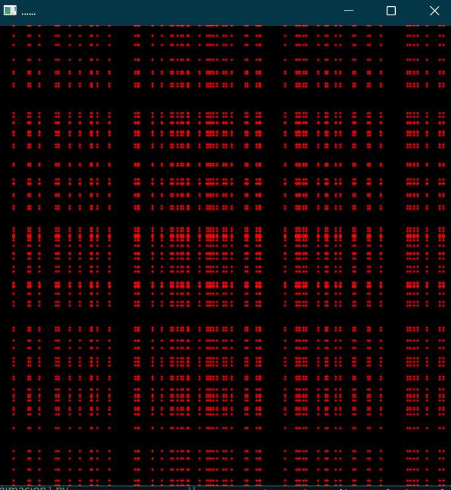

## El objetivo de esta practica es mejorar la comprensión de como usar y mostrar las graficas generadas por ecuaciones paramétricas

#### Comenzamos importando cv2, numpy y math
~~~
import cv2 as cv
import numpy as np
import math
~~~

#### Definimos variables que veremos porque son necesarias  a medida que avancemos
~~~
r=250
r1=250
r2=80
b=r
~~~

#### Creamos una ventana para mostrar cada grafica generada en una ventana diferente
~~~
img=np.zeros((500,500,3), dtype=np.uint8)
img2=np.zeros((500,500,3), dtype=np.uint8)
img3=np.zeros((500,500,3), dtype=np.uint8)
img4=np.zeros((500,500,3), dtype=np.uint8)
img5=np.zeros((500,500,3), dtype=np.uint8)
img6=np.zeros((500,500,3), dtype=np.uint8)
img7=np.zeros((500,500,3), dtype=np.uint8)
img8=np.zeros((500,500,3), dtype=np.uint8)
img9=np.zeros((500,500,3), dtype=np.uint8)
img10=np.zeros((500,500,3), dtype=np.uint8)
~~~

#### Definimos mas variables necesarias para algunas ecuaciones
~~~
x,y,z=img.shape
theta=0
theta_increment=0.05
theta_max = 2 * math.pi
center_x, center_y = x//2, y//2
~~~

## Ecuación 1: Sinceramente no se que es
#### Creo que estaba intentando hacer un circulo en esta ecuación, no salió eso, pero el resultado fue interesante
~~~
for i in range(0,x,5):
    for j in range(0,y,5):
        new_x = int(i+r*math.sin(i*0.05))
        new_y = int(j+r*math.cos(j*0.05))
        if 0 <= new_x < x and 0 <= new_y < y:
            cv.circle(img, (new_y, new_x), 1, (0, 0, 255), -1)
~~~

## Ecuación 2: Circulo
~~~
for t in np.arange(0,10*theta_max,theta_increment):
        x = center_x+int((r*math.cos(t)))
        y = center_y+int((r*math.sin(t)))   
        cv.circle(img2,(x,y),1,(0,0,255),-1)
~~~

## Ecuación 3: Intento de una espiral
~~~
for t in np.arange(0,40*theta_max,theta_increment):
        x = center_x+ int((1+r)*math.cos(t)) - int(b*(math.cos((1+(1/r))*t)))
        y = center_y+ int((1+r)*math.sin(t)) - int(b*(math.sin((1+(1/r))*t))) 
        cv.circle(img3,(x,y),1,(0,0,255),-1)
~~~

## Ecuación 4: Flor de 5 pétalos	
~~~
for t in np.arange(0,10*theta_max,theta_increment):
        x = center_x+ int(100*math.cos(t)) + int(50*math.cos(4*t)) 
        y = center_y+ int(100*math.sin(t)) - int(50*math.sin(4*t)) 
        cv.circle(img4,(x,y),1,(0,0,255),-1)
~~~

## Ecuación 5: Epicicloide
~~~
for t in np.arange(0,40*theta_max,theta_increment):
        x = center_x+ int( (r1-r2)*math.cos(t)+r2*math.cos(t*(1-(r1/r2))) ) 
        y = center_y+ int( (r1-r2)*math.sin(t)+r2*math.sin(t*(1-(r1/r2))) ) 
        cv.circle(img5,(x,y),1,(0,0,255),-1)
~~~

## Ecuación 6: Cardioide
~~~
for t in np.arange(0,40*theta_max,theta_increment):
        x = center_x+ int( 100*(math.sin(t) - math.sin(2*t)) ) 
        y = center_y+ int( 100*(math.cos(t) - math.cos(2*t)) ) 
        cv.circle(img6,(x,y),1,(0,0,255),-1)
~~~

## Ecuación 7: Elipse
~~~
for t in np.arange(0,20*theta_max,theta_increment):
        x = center_x+ int( 240*(math.cos(45*t)) )
        y = center_y+ int( 150*(math.sin(45*t)) )
        cv.circle(img7,(x,y),1,(0,0,255),-1)
~~~

## Ecuación 8: Trocoide
~~~
for t in np.arange(0,20*theta_max,theta_increment):
        x = int( 15*t - 30*(math.cos(t)) )
        y = center_y+ int( 15 - 30*(math.sin(t)) )
        cv.circle(img8,(x,y),1,(0,0,255),-1)
~~~

## Ecuación 9: Curva Plana
~~~
for t in np.arange(0,30*theta_max,theta_increment):
        x =int ( center_x + 150* math.cos(t) )
        y =int ( center_y + 150* math.sin(2*t) )
        cv.circle(img9,(x,y),1,(0,0,255),-1)
~~~

## Ecuación 10: Parabola
~~~        
for t in np.arange(-25,25,theta_increment):
        x =int (t)+center_x
        y =int (500 + -1*(t*t) )
        cv.circle(img10,(x,y),1,(0,0,255),-1) 
~~~

                
    
## Mostramos las ventanas con las graficas    
~~~    
cv.imshow("......",img)
cv.imshow("Circulo",img2)
cv.imshow("I dont know",img3)
cv.imshow("Petalos",img4)
cv.imshow("Epicicloide",img5)
cv.imshow("Cardioide",img6)
cv.imshow("Elipse",img7)
cv.imshow("Trocoide",img8)
cv.imshow("Curva Plana",img9)
cv.imshow("Parabola",img10)
cv.waitKey(0)
cv.destroyAllWindows()