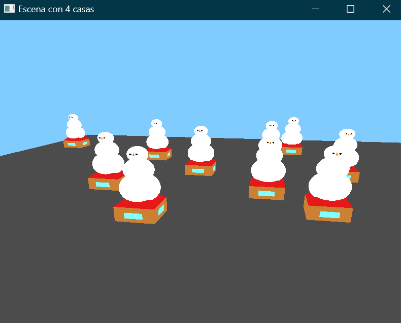

## El objetivo de esta practica fue agregar ventanas y muñecos de nieve a las casas ya previamente generadas con glut

#### Se importan las librerías necesarias para ejecutar el código
~~~
import glfw
from OpenGL.GL import *
from OpenGL.GLU import gluPerspective, gluLookAt, gluNewQuadric, gluSphere, gluPerspective, gluCylinder
import sys
~~~

#### Con la funcion init se inicializa OpenGL
~~~
def init():
    """Configuración inicial de OpenGL"""
    glClearColor(0.5, 0.8, 1.0, 1.0)  # Fondo azul cielo
    glEnable(GL_DEPTH_TEST)           # Activar prueba de profundidad

    # Configuración de la perspectiva
    glMatrixMode(GL_PROJECTION)
    gluPerspective(60, 1.0, 0.1, 100.0)  # Campo de visión más amplio
    glMatrixMode(GL_MODELVIEW)
~~~

#### Función para generar las 6 paredes de la casa y misma en la que se agregaron 2 cuadrados mas que simulan las ventanas
~~~
def draw_cube():
    """Dibuja el cubo (base de la casa)"""
    glBegin(GL_QUADS)
    glColor3f(0.8, 0.5, 0.2)  # Marrón para todas las caras
    
    # Frente
    glVertex3f(-1, 0, 1)
    glVertex3f(1, 0, 1)
    glVertex3f(1, 1, 1)
    glVertex3f(-1, 1, 1)

    # Atrás
    glVertex3f(-1, 0, -1)
    glVertex3f(1, 0, -1)
    glVertex3f(1, 1, -1)
    glVertex3f(-1, 1, -1)

    # Izquierda
    glVertex3f(-1, 0, -1)
    glVertex3f(-1, 0, 1)
    glVertex3f(-1, 1, 1)
    glVertex3f(-1, 1, -1)

    # Derecha
    glVertex3f(1, 0, -1)
    glVertex3f(1, 0, 1)
    glVertex3f(1, 1, 1)
    glVertex3f(1, 1, -1)

    # Arriba
    glColor3f(0.9, 0.6, 0.3)  # Color diferente para el techo
    glVertex3f(-1, 1, -1)
    glVertex3f(1, 1, -1)
    glVertex3f(1, 1, 1)
    glVertex3f(-1, 1, 1)

    # Abajo
    glColor3f(0.6, 0.4, 0.2)  # Suelo más oscuro
    glVertex3f(-1, 0, -1)
    glVertex3f(1, 0, -1)
    glVertex3f(1, 0, 1)
    glVertex3f(-1, 0, 1)   
    
    # VentanaFrente
    glColor3f(.5, 1, 1)
    glVertex3f(-.45, .30, 1.1)
    glVertex3f(.45, .30, 1.1)
    glVertex3f(.45, .70, 1.1)
    glVertex3f(-.45, .70, 1.1)
    
    # VentanaDerecha
    glColor3f(.5, 1, 1)
    glVertex3f(1.01, .30, -.45)
    glVertex3f(1.01, .30, .45)
    glVertex3f(1.01, .70, .45)
    glVertex3f(1.01, .70, -.45)
    
    glEnd()
~~~

#### Función para crear el techo de la casa en forma de pirámide
~~~
def draw_roof():
    """Dibuja el techo (pirámide)"""
    glBegin(GL_TRIANGLES)
    glColor3f(0.9, 0.1, 0.1)  # Rojo brillante

    # Frente
    glVertex3f(-1, 1, 1)
    glVertex3f(1, 1, 1)
    glVertex3f(0, 2, 0)

    # Atrás
    glVertex3f(-1, 1, -1)
    glVertex3f(1, 1, -1)
    glVertex3f(0, 2, 0)

    # Izquierda
    glVertex3f(-1, 1, -1)
    glVertex3f(-1, 1, 1)
    glVertex3f(0, 2, 0)

    # Derecha
    glVertex3f(1, 1, -1)
    glVertex3f(1, 1, 1)
    glVertex3f(0, 2, 0)
    glEnd()
~~~

#### Función para generar el suelo donde están las casas
~~~
def draw_ground():
    """Dibuja un plano para representar el suelo o calle"""
    glBegin(GL_QUADS)
    glColor3f(0.3, 0.3, 0.3)  # Gris oscuro para la calle

    # Coordenadas del plano
    glVertex3f(-20, 0, 20)
    glVertex3f(20, 0, 20)
    glVertex3f(20, 0, -20)
    glVertex3f(-20, 0, -20)
    glEnd()
~~~

#### Función para dibujar la casa, aquí se mandan llamar las funciones previamente definidas que son necesarias para dibujar la casa
~~~
def draw_house():
    """Dibuja una casa (base + techo)"""
    draw_cube()  # Base de la casa
    draw_roof()  # Techo
~~~

#### Función para dibujar esferas blancas para el cuerpo del muñeco de nieve
~~~
def draw_sphere(radius=1, x=0, y=0, z=0):
    glPushMatrix()
    glTranslatef(x, y, z)
    quadric = gluNewQuadric()
    gluSphere(quadric, radius, 32, 32)
    glPopMatrix()
~~~

#### Función para dibujar un cono que será la nariz del muñeco de nieve
~~~
def draw_cone(base=0.1, height=0.5, x=0, y=0, z=0):
    glPushMatrix()
    glTranslatef(x, y, z)
    glRotatef(-90, 1, 0, 0)  # Orientar el cono hacia adelante
    quadric = gluNewQuadric()
    gluCylinder(quadric, base, 0, height, 32, 32)
    glPopMatrix()
~~~

#### Función para dibujar el muñeco de nieve, al igual que con la función para dibujar la casa, se vuelve a llamar a las funciones previamente definidas que son necesarias para el muñeco de nieve
~~~
def draw_snowman():

    # Cuerpo
    glColor3f(1, 1, 1)
    draw_sphere(1.0, 0, 2, 0)     # Base
    draw_sphere(0.75, 0, 3.2, 0)  # Cuerpo medio
    draw_sphere(0.5, 0, 4.2, 0)   # Cabeza

    # Ojos
    glColor3f(0, 0, 0)
    draw_sphere(0.05, -0.15, 4.3, 0.5)  # Ojo izquierdo
    draw_sphere(0.05, 0.15, 4.3, 0.5)   # Ojo derecho

    # Nariz (cono)
    glColor3f(1, 0.5, 0)  # Color naranja
    draw_cone(0.05, 0.2, 0, 4.2, 0.5)  # Nariz
~~~
    
#### Función para dibujar la escena general, en esta función se llaman los modelos creados anteriormente(suelo, casa y muñeco de nieve), se guardan ciertos puntos en un arreglo y mediante un for se recorren cada uno de estos puntos y en cada uno se dibujan tanto una casa como un muñeco de nieve
~~~
def draw_scene():
    """Dibuja toda la escena con 4 casas"""
    glClear(GL_COLOR_BUFFER_BIT | GL_DEPTH_BUFFER_BIT)
    glLoadIdentity()
    

    # Configuración de la cámara
    gluLookAt(5, 8, 25,  # Posición de la cámara
              0, 0, 0,    # Punto al que mira
              0, 1, 0)    # Vector hacia arriba

    # Dibujar el suelo
    draw_ground()

    # Dibujar las casas en diferentes posiciones
    positions = [
        (-5, 0, -5),  # Casa 1
        (5, 0, -5),   # Casa 2
        (-5, 0, 5),   # Casa 3
        (5, 0, 5),
        (0, 0, 0),
        (10, 0, 0),
        (-16, 0, -10),
        (8, 0, 8),
        (7, 0, -10),
        (-1, 0, 10)# Casa 4
    ]
    for pos in positions:
        glPushMatrix()
        glTranslatef(*pos)  # Mover la casa a la posición actual
        draw_house()        # Dibujar la casa
        draw_snowman()
        glPopMatrix()

    glfw.swap_buffers(window)
~~~

## Función main
#### Se inicializa glfw, se crea una ventana y se llama la función draw_scene en esta ventana
~~~
def main():
    global window

    # Inicializar GLFW
    if not glfw.init():
        sys.exit()
    
    # Crear ventana de GLFW
    width, height = 800, 600
    window = glfw.create_window(width, height, "Escena con 4 casas", None, None)
    if not window:
        glfw.terminate()
        sys.exit()

    glfw.make_context_current(window)
    glViewport(0, 0, width, height)
    init()

    # Bucle principal
    while not glfw.window_should_close(window):
        draw_scene()
        glfw.poll_events()

    glfw.terminate()

if __name__ == "__main__":
    main()