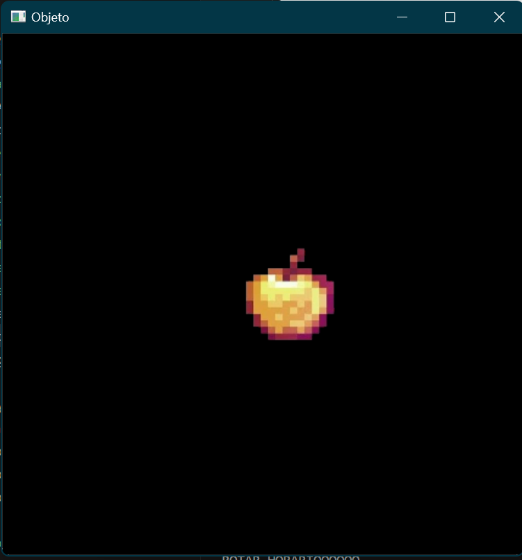
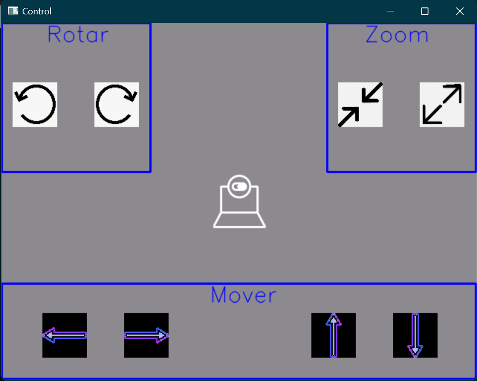

## El objetivo de este programa es controlar una imagen mediante flujo óptico, aplicando a esta transformaciones geométricas como traslación, rotación y escalamiento

## Empezamos importando las librerías de numpy y cv2, posteriormente se crea una ventana en negro donde se va a mostrar la imagen que estaremos controlando
~~~
import numpy as np
import cv2 as cv

# Creacion de una ventana donde vamos a "pegar" la imagen principal del proyecto
objeto = np.zeros((500, 500, 3), dtype="uint8")
~~~
## Valores iniciales de las variables globales de rotación y escalamiento
##### Aquí inicializamos las variables que utilizaremos mas adelante para las funciones de rotación y escalamiento
~~~
angulo_total = 0
escala_total = 1
~~~
## Importación de la imagen
##### En este caso yo utilizare una imagen de una manzana dorada que esta dentro de la misma carpeta que el código, así que solo llamo al archivo png sin rutas y posteriormente cambio su tamaño a uno mas adecuado para mostrar
~~~
imagen = cv.imread("manzana.png")
imagen = cv.resize(imagen, (150, 100))
~~~
## Coordenadas iniciales de la imagen en ventana
##### Aquí se especifica en que posición de la ventana estará la imagen cuando inicie la ejecución
~~~
y_offset = 200  
x_offset = 200  
~~~
## Primer "pegado" de la imagen
### Con esta línea de código se "pega" la imagen sobre la ventana que iniciamos antes en las coordenadas iniciales
~~~
objeto[y_offset:y_offset+imagen.shape[0], x_offset:x_offset+imagen.shape[1]] = imagen
~~~

## Importamos las imágenes a usar en la interfaz
##### Aquí llamaremos las imágenes previamente descargadas que servirán para mostrar una interfaz con la cual el usuario pueda interactuar con el programa
~~~
flecha1 = cv.imread("flecha1.png")
flecha2 = cv.imread("flecha2.png")
flecha3 = cv.imread("flecha3.png")
flecha4 = cv.imread("flecha4.png")
flecha5 = cv.imread("flecha5.png")
flecha6 = cv.imread("flecha6.png")
flecha7 = cv.imread("flecha7.png")
flecha8 = cv.imread("flecha8.png")
~~~

## Se inicia la captura de video y se manda llamar lkparm que servirá para registrar el flujo óptico
~~~
cap = cv.VideoCapture(0)

lkparm =dict(winSize=(15,15), maxLevel=2,
             criteria=(cv.TERM_CRITERIA_EPS | cv.TERM_CRITERIA_COUNT, 10, 0.03)) 

_, vframe = cap.read()
vgris = cv.cvtColor(vframe, cv.COLOR_BGR2GRAY)
~~~
## Se crea un arreglo con las ubicaciones estratégicas de los puntos que registran el flujo óptico
~~~
p0 = np.array([(140,420), (502,420), (100,110), (538,110)])
p0 = np.float32(p0[:, np.newaxis, :])
mask = np.zeros_like(vframe) 
cad =''
~~~

## Textos para las funciones
##### Aquí agregamos las cadenas de texto que se mostraran en la interfaz
~~~
texto1,texto2,texto3="Mover" ,"Rotar" ,"Zoom"
~~~

## Función para ajustar
##### Similar a lo que hicimos antes buscamos "pegar" las flechas en la ventana de interfaz, para lo cual requerimos ajustar las imágenes y especificar en que lugar van a estar, para lo cual se define esta función que las ajustará 
~~~
def ajustar(imagen):
    return cv.resize(imagen, (60,60))
~~~

## Creamos un diccionario para la ubicación de las flechas
##### Posteriormente se usará este diccionario para verificar si el nuevo punto generado por flujo óptico esta dentro de alguna de las áreas de las flechas
~~~
ubicaciones_flechas = [
    {"nombre": "flecha1", "area": (55, 115, 390, 450)},
    {"nombre": "flecha2", "area": (165, 225, 390, 450)},
    {"nombre": "flecha3", "area": (417, 477, 390, 450)},
    {"nombre": "flecha4", "area": (527, 587, 390, 450)},
    {"nombre": "flecha5", "area": (15, 75, 80, 140)},
    {"nombre": "flecha6", "area": (125, 185, 80, 140)},
    {"nombre": "flecha7", "area": (453, 513, 80, 140)},
    {"nombre": "flecha8", "area": (563, 623, 80, 140)},
]
~~~
## Función para verificar si un punto está dentro de un área de las flechas
##### Con esta función se verifica si el punto de flujo óptico entro en alguna de las áreas de las flechas
~~~
def punto_en_area(x, y, area):
    # Se obitienen los valores del area de cada flecha para verificar si la bolita de flujo optico "entra"
    x1, x2, y1, y2 = area
    return x1 <= x <= x2 and y1 <= y <= y2
~~~

## Función de traslación 
##### Con esta función se traslada la imagen ya sea en X o en Y en base a los valores ingresados a la función
~~~
def traslacion(dx,dy):
    global objeto, imagen, y_offset, x_offset
    # Actuaizamos los valores donde vamos a "pegar" la imagen
    y_offset += dy
    x_offset += dx
    
    # Verificacion para que la imagen no salga de los limites
    y_offset = max(0, min(objeto.shape[0] - imagen.shape[0], y_offset))
    x_offset = max(0, min(objeto.shape[1] - imagen.shape[1], x_offset))
    
    # Limpiamos y actualizamos la posición de la imagen
    objeto.fill(0)
    # Pegamos la imagen trasladada en la ventana objeto
    objeto[y_offset:y_offset+imagen.shape[0], x_offset:x_offset+imagen.shape[1]] = imagen
~~~

## Función de rotación  
##### Con esta función se rota la imagen en base a un ángulo ingresado ya sea en sentido horario si el ángulo es negativo o en sentido antihorario si el ángulo es positivo
~~~
def rotar(angulo):
    global imagen, objeto, x_offset, y_offset, angulo_total
    
    # Actualizamos el valor global de el angulo en base al nuevo
    angulo_total += angulo
    # Obtenemos los valores actuales de x,y
    x, y = imagen.shape[:2]
    # Obtenemos el centro
    centro = (y // 2, x // 2)
    M = cv.getRotationMatrix2D(centro, angulo_total, 1.0)
    # Y rotamos usando getRotation y WarpAffine
    imagen_rotada = cv.warpAffine(imagen, M, (y, x))
    objeto.fill(0)
    # "Pegamos la imagen en la ventana objeto"
    objeto[y_offset:y_offset+imagen_rotada.shape[0], x_offset:x_offset+imagen_rotada.shape[1]] = imagen_rotada
~~~

## Función de escalamiento  
##### Con esta función se escala la imagen en base al valor de escala ingresado, si es mayor a 1 aumenta y si es menor encoge la imagen
~~~
def escalar(escala):
    global imagen, objeto, x_offset, y_offset, escala_total
    
    # Se actualiza el valor de escala global con la nueva escala
    escala_total *= escala
    
    # Se calculan los nuevos tamaños en x, y para la imagen escalada
    nuevo_ancho = int(imagen.shape[1] * escala_total)
    nuevo_alto = int(imagen.shape[0] * escala_total)
    
    # Obtenemos los valores de x,y de la ventana
    max_ancho = objeto.shape[1]
    max_alto = objeto.shape[0]
    # Se establece un minimo cuadrado para el tamaño de la imagen escalada en este caso 10x10
    minimo = 10  
    
    # Se verfifica si las nuevas medidas sobrepasan el tamaño de la ventana y si es así se "restablece" el valor anterior de la escala_total
    if nuevo_ancho > max_ancho or nuevo_alto > max_alto or nuevo_ancho < minimo or nuevo_alto < minimo:
        print("SE EXCEDIO")
        escala_total /= escala 
        return  

    # Continuamos escalando usando resize
    imagen_escalada = cv.resize(imagen, (nuevo_ancho, nuevo_alto))
    objeto.fill(0)
    
    # Recalculamos la posición para centrar la nueva imagen escalada
    y_offset = (objeto.shape[0] - nuevo_alto) // 2
    x_offset = (objeto.shape[1] - nuevo_ancho) // 2
    
    # Volvemos a "pegar" la imagen en la ventana
    objeto[y_offset:y_offset+nuevo_alto, x_offset:x_offset+nuevo_ancho] = imagen_escalada
~~~

## Función que se ejecuta al tocar las flechas con flujo óptico
##### Una vez que el punto de flujo óptico toca el área de alguna de las flechas se ejecuta la acción asignada a esa flecha
~~~
def accion_flecha(nombre_flecha):
    if(nombre_flecha=="flecha1"):
        print(f"IZQUIERDAAAAAAAAAA")
        traslacion(-50,0)
    elif(nombre_flecha=="flecha2"):
        print(f"DERECHAAAAAAA")
        traslacion(50,0)
    elif(nombre_flecha=="flecha3"):
        print(f"ARRIBAAA")
        traslacion(0,-50)  
    elif(nombre_flecha=="flecha4"):
        print(f"ABAJOOOOOOOOOOOOOOOOO")
        traslacion(0,50)
    elif(nombre_flecha=="flecha5"):
        print(f"ROTAR ANTI-HORARIOOOOOO")
        rotar(15)
    elif(nombre_flecha=="flecha6"):
        print(f"ROTAR HORARIOOOOOO")
        rotar(-15)
    elif(nombre_flecha=="flecha7"):
        print(f"DISMINUYEEEEEEEE")
        escalar(0.8)
    elif(nombre_flecha=="flecha8"):
        print(f"AUMENTAAAAAAAAAAAAAA")
        escalar(1.2)    
~~~

## Función para mostrar la interfaz
##### Esta función "pega" la interfaz en el frame capturado por la cámara continuamente. Comenzamos por "pegar" las flechas ajustadas en el frame exacto, posteriormente se dibujan rectángulos que separan las funciones y finalmente se muestran los textos definidos al inicio para servir de guía sobre que función tiene las flechas

~~~
def mostrar_interfaz(frame):
    
    #Mostramos las flechas en ubicaciones especificas
    frame[390:450, 55:115] = ajustar(flecha1)
    frame[390:450, 165:225] = ajustar(flecha2)
    frame[390:450, 417:477] = ajustar(flecha3)
    frame[390:450, 527:587] = ajustar(flecha4)
    frame[80:140, 15:75] = ajustar(flecha5)
    frame[80:140, 125:185] = ajustar(flecha6)
    frame[80:140, 453:513] = ajustar(flecha7)
    frame[80:140, 563:623] = ajustar(flecha8)
    
    #Cuadrados para dividir las funciones
    cv.rectangle(frame, (0,350), (638,478), (255, 0 ,0), 2 )
    cv.rectangle(frame, (0,0), (200,200), (255, 0 ,0), 2 )
    cv.rectangle(frame, (438,0), (638,200), (255, 0 ,0), 2 )
    
    #Texto para los cuadros que sirven para las funciones de trasladar, rotar y escalar
    cv.putText(frame,texto1,(280,375),cv.FONT_HERSHEY_SIMPLEX, 1, (255,0,0), 1, cv.LINE_AA)
    cv.putText(frame,texto2,(60,25),cv.FONT_HERSHEY_SIMPLEX, 1, (255,0,0), 1, cv.LINE_AA)
    cv.putText(frame,texto3,(488,25),cv.FONT_HERSHEY_SIMPLEX, 1, (255,0,0), 1, cv.LINE_AA)
        
~~~

## Ciclo donde se ejecuta todo
~~~
while True:
    
    _, frame = cap.read()
    #frame tiene 640 de ancho y 480 de alto
    fgris = cv.cvtColor(frame, cv.COLOR_BGR2GRAY)
    p1, st, err = cv.calcOpticalFlowPyrLK(vgris, fgris, p0, None, **lkparm)
    # WaitKey para capturar alguna tecla
    key = cv.waitKey(1) & 0xFF
    
    #Mostramos la interfaz del programa
    mostrar_interfaz(frame)
            
    # Si no hay cambio en el flujo optico se muestra la "malla" de puntos en sus posiciones iniciales
    if p1 is None:
        vgris = cv.cvtColor(vframe, cv.COLOR_BGR2GRAY)
        p0 = np.array([(100,100), (200,100), (300,100), (400,100) ])
        p0 = np.float32(p0[:, np.newaxis, :])
        mask = np.zeros_like(vframe)
        cv.imshow('Control', frame)
        cv.imshow('Objeto', objeto)
    # Si hay cambio en el flujo optico se inicia otro proceso
    else:
        bp1 = p1[st ==1]
        bp0 = p0[st ==1]
        
        # Se inicia un ciclo for que va a "buscar" el cambio en el flujo optico y va a dibujar un circulo en la nueva posicion
        # Que registra el flujo optico y una linea que va a conectar el nuevo punto con el anterior
        for i, (nv, vj) in enumerate(zip(bp1, bp0)):
            a, b = (int(x) for x in nv.ravel())
            c, d = (int(x) for x in vj.ravel())
            dist = np.linalg.norm(nv.ravel() - vj.ravel())
            frame = cv.line(frame, (c,d), (a,b), (0,0,255), 2)
            frame = cv.circle(frame, (c,d), 2, (255,0,0),-1)
            frame = cv.circle(frame, (a,b), 3, (0,255,0),-1)
            
            # Ciclo para saber si se ejecutaran alguna accion en caso de haber tocado alguna flecha
            for flecha in ubicaciones_flechas:
                # Se busca dentro del diccionario si la bolita esta dentro de alguna de las areas de las flechas
                if punto_en_area(a, b, flecha["area"]):
                    # Si es asi ejecuta la funcion para la accion de la flecha correspondiente
                    accion_flecha(flecha["nombre"])
        
        # Se agrega un "switch" para facilitar la presentacion de las funciones del programa
        if key == ord('a'):
            accion_flecha("flecha1")
        elif key == ord('d'):
            accion_flecha("flecha2") 
        elif key == ord('w'):
            accion_flecha("flecha3")
        elif key == ord('s'):
            accion_flecha("flecha4")
        elif key == ord('f'):
            accion_flecha("flecha5")
        elif key == ord('h'):
            accion_flecha("flecha6")
        elif key == ord('g'):
            accion_flecha("flecha7")
        elif key == ord('t'):
            accion_flecha("flecha8")    
            
        # Se muestran las ventanas   
        cv.imshow('Control', frame)
        cv.imshow('Objeto', objeto)

        vgris = fgris.copy()

        # WaitKey para salir del programa
        if(cv.waitKey(1) & 0xff) == 27:
            break    
        
cap.release()
cv.destroyAllWindows()
