## El objetivo de este proyecto es crear un mundo 3D con diferentes modelos dentro de el y poder explorarlo mediante el uso de flujo óptico

##### Se importan las librerías a usar
~~~
import numpy as np
import cv2 as cv
import glfw
from OpenGL.GL import *
from OpenGL.GLU import *
from PIL import Image, ImageOps
import sys
~~~

## Posiciones iniciales de la cámara y su velocidad de movimiento
##### Estas variables son las que definen donde va a mirar la cámara y a que velocidad se va a mover; look_x es agregado para poder fijar la cámara en una pos_x diferente durante la ejecución y poder volver a mirar al centro del mundo mas tarde
~~~
pos_x = 0
pos_y = 3
pos_z = 10
speed = 1
look_x = 0
~~~

# Variables globales para texturas
##### Se crea un arreglo que mas tarde se vuelve un diccionario, para poder almacenar las imágenes que serán usadas como texturas junto a un nombre
~~~
textures = {}
~~~

## Importamos las imágenes a usar para la interfaz
##### Al igual que en el proyecto 1 se usaran las mismas flechas para esta interfaz
~~~
flecha1 = cv.imread("flecha1.png")
flecha2 = cv.imread("flecha2.png")
flecha3 = cv.imread("flecha3.png")
flecha4 = cv.imread("flecha4.png")
flecha5 = cv.imread("flecha5.png")
flecha6 = cv.imread("flecha6.png")
flecha7 = cv.imread("flecha7.png")
flecha8 = cv.imread("flecha8.png")
~~~

## Se inicia la captura de video y se manda llamar lkparm que servirá para registrar el flujo óptico
~~~
cap = cv.VideoCapture(0)

lkparm =dict(winSize=(15,15), maxLevel=2,
             criteria=(cv.TERM_CRITERIA_EPS | cv.TERM_CRITERIA_COUNT, 10, 0.03)) 

_, vframe = cap.read()
vgris = cv.cvtColor(vframe, cv.COLOR_BGR2GRAY)
p0 = np.array([(140,420), (502,420), (100,110)])
p0 = np.float32(p0[:, np.newaxis, :])
mask = np.zeros_like(vframe) 
cad =''
~~~

## Textos para las funciones
~~~
texto1,texto2 = "Mover" ,"Zoom" 
~~~

## Función para ajustar las flechas
~~~
def ajustar(imagen):
    return cv.resize(imagen, (80,80))
~~~

## Creamos un diccionario para las áreas de las flechas
~~~
ubicaciones_flechas = [
    {"nombre": "flecha1", "area": (55, 135, 380, 460)},
    {"nombre": "flecha2", "area": (145, 225, 380, 460)},
    {"nombre": "flecha3", "area": (417, 497, 380, 460)},
    {"nombre": "flecha4", "area": (507, 587, 380, 460)},
    {"nombre": "flecha5", "area": (15, 95, 70, 150)},
    {"nombre": "flecha6", "area": (105, 185, 70, 150)},
]
~~~

## Función para verificar si el punto de flujo óptico está dentro de un área de las flechas
~~~
def punto_en_area(x, y, area):
    # Se obitienen los valores del area de cada flecha para verificar si la bolita de flujo optico "entra"
    x1, x2, y1, y2 = area
    return x1 <= x <= x2 and y1 <= y <= y2
~~~
## Función que se ejecuta al tocar las flechas con flujo óptico
##### Misma situación que en el proyecto 1, solo que aquí se aplica para mover a la cámara
~~~
def accion_flecha(nombre_flecha):
    global pos_x, pos_y, pos_z, speed
    if(nombre_flecha=="flecha1"):
        print(f"IZQUIERDAAAAAAAAAA")
        pos_x -= speed  # Mover a la izquierda
    elif(nombre_flecha=="flecha2"):
        print(f"DERECHAAAAAAA")
        pos_x += speed  # Mover a la derecha
    elif(nombre_flecha=="flecha3"):
        print(f"ADELANTEEEEEEEEEEE")
        pos_z -= speed  # Mover hacia adelante
    elif(nombre_flecha=="flecha4"):
        print(f"ATRAAAAAAAAAAAAAAAAAS")
        pos_z += speed  # Mover hacia atras
    elif(nombre_flecha=="flecha5"):
        print(f"SUBIIIIIIIIIIIIIIIIIIIIR")
        pos_y += speed  # Mover hacia arriba
    elif(nombre_flecha=="flecha6"):
        # Verificacion para no bajar del limite del Mundo3D
        if pos_y <= 1:
            print("NO SE PUEDE BAJAR MAAAAAAAAAAAAAAAAS")
            return
        print(f"BAJAAAAAAAAAAAAAAAAAAAR")
        pos_y -= speed  # Mover hacia abajo 
~~~         
## Función para dibujar los rectángulos y mostrar las flechas y círculos con los que el usuario va a interactuar
##### Misma interfaz que en el proyecto 1, pero con 2 flechas menos 
~~~
def mostrar_interfaz(frame):
    
    #Mostramos las flechas en ubicaciones especificas
    frame[380:460, 55:135] = ajustar(flecha1)
    frame[380:460, 145:225] = ajustar(flecha2)
    frame[380:460, 417:497] = ajustar(flecha3)
    frame[380:460, 507:587] = ajustar(flecha4)
    frame[70:150, 15:95] = ajustar(flecha5)
    frame[70:150, 105:185] = ajustar(flecha6)
    
    
    #Cuadrados para dividir las funciones
    cv.rectangle(frame, (0,350), (638,478), (255, 0 ,0), 2 )
    cv.rectangle(frame, (0,0), (200,200), (255, 0 ,0), 2 )
    
    #Texto para los cuadros que sirven para las funciones de trasladar, rotar y escalar
    cv.putText(frame,texto1,(280,375),cv.FONT_HERSHEY_SIMPLEX, 1, (255,0,0), 1, cv.LINE_AA)
    cv.putText(frame,texto2,(60,25),cv.FONT_HERSHEY_SIMPLEX, 1, (255,0,0), 1, cv.LINE_AA)
~~~
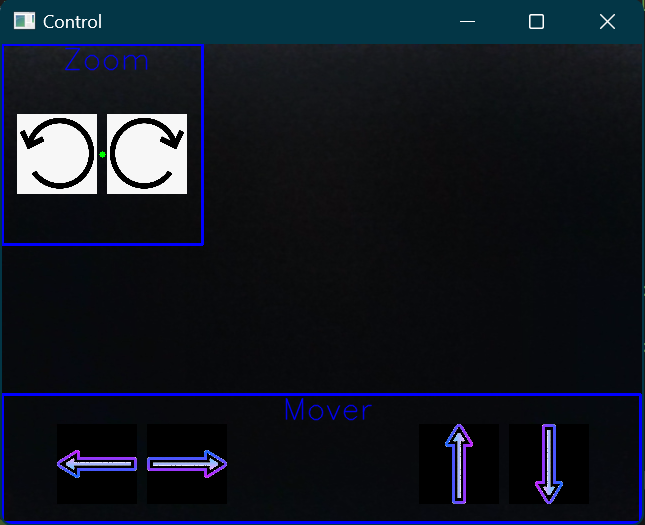

## Función para cargar texturas
##### Con esta función se ingresa la ruta de la imagen a cargar como textura y se regresa el id con el que se va a identificar esa textura
~~~
def load_texture(image_path):
    img = Image.open(image_path)
    img = ImageOps.exif_transpose(img)
    img = img.resize((128, 128), Image.LANCZOS)
    img = img.rotate(180)
    img = img.convert("RGB")
    img_data = np.array(img).tobytes()

    texture_id = glGenTextures(1)
    glBindTexture(GL_TEXTURE_2D, texture_id)
    glTexImage2D(GL_TEXTURE_2D, 0, GL_RGB, img.width, img.height, 0, GL_RGB, GL_UNSIGNED_BYTE, img_data)
    glTexParameteri(GL_TEXTURE_2D, GL_TEXTURE_MIN_FILTER, GL_LINEAR)
    glTexParameteri(GL_TEXTURE_2D, GL_TEXTURE_MAG_FILTER, GL_LINEAR)
    glTexParameteri(GL_TEXTURE_2D, GL_TEXTURE_WRAP_S, GL_REPEAT)
    glTexParameteri(GL_TEXTURE_2D, GL_TEXTURE_WRAP_T, GL_REPEAT)
    
    return texture_id
~~~
## Función para inicializar los métodos de OpenGL y donde guardamos el diccionario de texturas
~~~
def init():
    """Configuración inicial de OpenGL"""
    global textures
    glClearColor(0.5, 0.8, 1.0, 1.0)  # Fondo azul cielo
    glEnable(GL_DEPTH_TEST)  # Activar prueba de profundidad
    glEnable(GL_TEXTURE_2D)  # Habilitar texturas

    # Configuración de la perspectiva
    glMatrixMode(GL_PROJECTION)
    gluPerspective(60, 1.0, 0.1, 100.0)  # Campo de visión más amplio
    glMatrixMode(GL_MODELVIEW)
~~~
##### Aquí dentro del diccionario textures usando la función load_texture se almacena la imagen cargada como textura que será usada para los modelos mas tarde
~~~
    # Cargar texturas y almacenar sus IDs en el diccionario
     # Texturas para el suelo
    textures['grass'] = load_texture("grass.jpg")
     # Texturas para el arbol
    textures['tronco'] = load_texture("tronco.png")
    textures['hojas'] = load_texture("hojas.png")
     # Texturas para el cerdito
    textures['pig'] = load_texture("pig.png")
    textures['pig_body'] = load_texture("pig_body.png")
    textures['pig_leg'] = load_texture("pig_leg.png")
    textures['pig_tail'] = load_texture("pig_tail.png")
    textures['pig_ear1'] = load_texture("pig_ear1.png")
    textures['pig_ear2'] = load_texture("pig_ear2.png")
    # Texturas para la vaca
    textures['cow'] = load_texture("cow.png")
    textures['cow_body'] = load_texture("cow_body.png")
    textures['cow_tail'] = load_texture("cow_tail.png")
    textures['cow_ear1'] = load_texture("cow_ear1.png")
    textures['cow_ear2'] = load_texture("cow_ear2.png")
    textures['cow_leg1'] = load_texture("cow_leg1.png")
    textures['cow_leg2'] = load_texture("cow_leg2.png")
    # Texturas para la oveja
    textures['sheep'] = load_texture("sheep.png")
    textures['sheep_body'] = load_texture("sheep_body.png")
    textures['sheep_leg_upper'] = load_texture("sheep_leg_upper.png") 
    textures['sheep_leg'] = load_texture("sheep_leg.png")
    # Texturas para el lobo
    textures['wolf'] = load_texture("wolf.png")
    textures['wolf_leg'] = load_texture("wolf_leg.png")
    textures['wolf_body'] = load_texture("wolf_body.png")
    textures['wolf_ears'] = load_texture("wolf_ears.png")
    textures['wolf_neck1'] = load_texture("wolf_neck1.png")
    textures['wolf_neck2'] = load_texture("wolf_neck2.png")
    textures['wolf_nose_front'] = load_texture("wolf_nose_front.png")
    textures['wolf_nose_left'] = load_texture("wolf_nose_left.png")
    textures['wolf_nose_right'] = load_texture("wolf_nose_right.png")
    textures['wolf_nose_upper'] = load_texture("wolf_nose_upper.png")
    textures['wolf_1'] = load_texture("wolf_1.png")
    textures['wolf_2'] = load_texture("wolf_2.png")
    # Texturas para las vallas
    textures['fence'] = load_texture("fence.png") 
    textures['fence_1'] = load_texture("fence_1.png") 
    textures['fence_2'] = load_texture("fence_2.png") 
    textures['fence_upper'] = load_texture("fence_upper.png") 
    textures['fence_up'] = load_texture("fence_up.png")
    # Texturas para steve 
    textures['steve'] = load_texture("steve.png")
    textures['steve_arm1'] = load_texture("steve_arm1.png") 
    textures['steve_arm2'] = load_texture("steve_arm2.png")  
    textures['steve_arm3'] = load_texture("steve_arm3.png") 
    textures['steve_arm4'] = load_texture("steve_arm4.png")
    textures['steve_arm5'] = load_texture("steve_arm5.png") 
    textures['steve_back'] = load_texture("steve_back.png") 
    textures['steve_body'] = load_texture("steve_body.png") 
    textures['steve_body_upper'] = load_texture("steve_body_upper.png") 
    textures['steve_ear1'] = load_texture("steve_ear1.png")
    textures['steve_ear2'] = load_texture("steve_ear2.png") 
    textures['steve_hair1'] = load_texture("steve_hair1.png")
    textures['steve_hair2'] = load_texture("steve_hair2.png")
    textures['steve_legs1'] = load_texture("steve_legs1.png")
    textures['steve_legs2'] = load_texture("steve_legs2.png")
    textures['steve_legs3'] = load_texture("steve_legs3.png")
    textures['steve_legs4'] = load_texture("steve_legs4.png")
    textures['steve_lower'] = load_texture("steve_lower.png")
    # Texturas para creeper
    textures['creeper'] = load_texture("creeper.png")
    textures['creeper_back'] = load_texture("creeper_back.png")
    textures['creeper_body'] = load_texture("creeper_body.png")
    textures['creeper_upper'] = load_texture("creeper_upper.png")
    textures['creeper_legs'] = load_texture("creeper_legs.png")
    textures['creeper_legs1'] = load_texture("creeper_legs1.png")
    textures['creeper_legs2'] = load_texture("creeper_legs2.png")
    textures['creeper_legs3'] = load_texture("creeper_legs3.png")
    # Texturas para slime
    textures['slime'] = load_texture("slime.png")
    textures['slime_back'] = load_texture("slime_back.png")
    textures['slime_upper'] = load_texture("slime_upper.png")
    textures['slime1'] = load_texture("slime1.png")
    textures['slime2'] = load_texture("slime2.png")
    # Texturas para herobrine
    textures['herobrine'] = load_texture("herobrine.png")
~~~    

## Función para dibujar el suelo del mundo
##### Se especifica el tamaño del cuadrado que será el suelo del mundo y se le asigna una textura
~~~
def draw_ground(texture_name):
    """Dibuja un plano para representar el suelo"""
    glBindTexture(GL_TEXTURE_2D, textures[texture_name])
    glBegin(GL_QUADS)
    glVertex3f(-30, 0, 30)
    glVertex3f(30, 0, 30)
    glVertex3f(30, 0, -30)
    glVertex3f(-30, 0, -30)
    glEnd()
~~~

## Función para dibujar cuadrados frontales
##### Se especifica el punto donde inicia el cuadrado, así como su ancho y alto, además se le asigna una textura
~~~
def draw_cuadrado_frontal(x, y, z, ancho, alto, texture_name):
    """Dibuja un cuadrado con textura en su cara frontal"""
    glBindTexture(GL_TEXTURE_2D, textures[texture_name])
    glBegin(GL_QUADS)
    glTexCoord2f(0.0, 0.0)
    glVertex3f(x, y, z)  # Vértice inferior izquierdo
    glTexCoord2f(1.0, 0.0)
    glVertex3f(x + ancho, y, z)  # Vértice inferior derecho
    glTexCoord2f(1.0, 1.0)
    glVertex3f(x + ancho, y + alto, z)  # Vértice superior derecho
    glTexCoord2f(0.0, 1.0)
    glVertex3f(x, y + alto, z)  # Vértice superior izquierdo
    glEnd()
~~~

## Función para dibujar un cuadrado lateral
##### Mismo caso que el anterior solo que ahora lo dibuja lateralmente
~~~
def draw_cuadrado_lateral(x, y, z, ancho, alto, texture_name):
    """Dibuja un cuadrado con textura en su cara lateral"""
    glBindTexture(GL_TEXTURE_2D, textures[texture_name])
    glBegin(GL_QUADS)
    glTexCoord2f(0.0, 0.0)
    glVertex3f(x, y, z)  # Vértice inferior izquierdo
    glTexCoord2f(1.0, 0.0)
    glVertex3f(x, y, z + ancho)  # Vértice inferior derecho
    glTexCoord2f(1.0, 1.0)
    glVertex3f(x, y + alto, z + ancho)  # Vértice superior derecho
    glTexCoord2f(0.0, 1.0)
    glVertex3f(x, y + alto, z)  # Vértice superior izquierdo
    glEnd()
~~~

## Función para dibujar un cuadrado viendo hacia arriba
##### Mismo caso que los 2 anteriores pero ahora mirando hacia arriba
~~~
def draw_cuadrado_arriba(x, y, z, ancho, largo, texture_name):
    """Dibuja un cuadrado con textura orientado hacia arriba."""
    glBindTexture(GL_TEXTURE_2D, textures[texture_name])
    glBegin(GL_QUADS)
    glTexCoord2f(0.0, 0.0)
    glVertex3f(x, y, z)  # Vértice inferior izquierdo
    glTexCoord2f(1.0, 0.0)
    glVertex3f(x + ancho, y, z)  # Vértice inferior derecho
    glTexCoord2f(1.0, 1.0)
    glVertex3f(x + ancho, y, z + largo)  # Vértice superior derecho
    glTexCoord2f(0.0, 1.0)
    glVertex3f(x, y, z + largo)  # Vértice superior izquierdo
    glEnd()
~~~

## Función para dibujar un cubo
##### Usando las 3 funciones anteriores se dibuja un cubo, al igual que antes la función recibe el punto inicial, el ancho y alto, pero ahora recibe también el largo o profundidad del cubo, además que recibe un diccionario con las texturas correspondiente a cada cara del cubo
~~~
def draw_cubo(x, y, z, ancho, alto, largo, textures_names):
    
    # Cara frontal 
    draw_cuadrado_frontal(x, y, z + largo, ancho, alto, textures_names['frontal'])
    # Cara trasera
    draw_cuadrado_frontal(x, y, z, ancho, alto, textures_names['trasera'])
    
    # Cara lateral izquierda
    draw_cuadrado_lateral(x, y, z, largo, alto, textures_names['izquierda'])
    # Cara lateral derecha
    draw_cuadrado_lateral(x + ancho, y, z, largo, alto, textures_names['derecha'])

    # Cara superior
    draw_cuadrado_arriba(x, y + alto, z, ancho, largo, textures_names['arriba'])
    # Cara inferior
    draw_cuadrado_arriba(x, y, z, ancho, largo, textures_names['abajo'])
~~~

## Inicio de los modelos
## Modelo 1 (Árbol)
##### En este modelo aun no definia la funcion para dibujar cubos, por lo cual este modelo en particular esta hecho con las funciones para dibujar cuadrados solamente
~~~
def draw_hoja_arbol():
    """Función para dibujar las hojas del arbol"""
    #Hoja grande (abajo)
    draw_cuadrado_frontal(-3, 4, 3, 5, 3, 'hojas')
    draw_cuadrado_frontal(-3, 4, -2, 5, 3, 'hojas')
    draw_cuadrado_arriba(-3, 4, -2, 5, 5, 'hojas')
    draw_cuadrado_arriba(-3, 7, -2, 5, 5, 'hojas')
    draw_cuadrado_lateral(-3, 4, -2, 5, 3, 'hojas')
    draw_cuadrado_lateral(2, 4, -2, 5, 3, 'hojas')
    #Hoja mediana (arriba)
    draw_cuadrado_frontal(-2, 7, 2, 3, 2.5, 'hojas')
    draw_cuadrado_frontal(-2, 7, -1, 3, 2.5, 'hojas')
    draw_cuadrado_arriba(-2, 9.5, -1, 3, 3, 'hojas')
    draw_cuadrado_lateral(-2, 7, -1, 3, 2.5, 'hojas')
    draw_cuadrado_lateral(1, 7, -1, 3, 2.5, 'hojas')
def draw_arbol():
    """Función para dibujar un arbol"""
    draw_cuadrado_frontal(-1.25, 0, 1, 1.5, 4, 'tronco')
    draw_cuadrado_frontal(-1.25, 0, -0.5, 1.5, 4, 'tronco')
    draw_cuadrado_lateral(0.25, 0, -0.5, 1.5, 4, 'tronco')
    draw_cuadrado_lateral(-1.25, 0, -0.5, 1.5, 4, 'tronco')
    draw_hoja_arbol()
~~~

## Modelo 2 (Cerdo)
##### A partir de aqui ya se habia definido la funcion para dibujar cubos por lo cual de este modelo en adelante dentro de la funcion se definen diferentes diccionarios para las texturas de cada cubo necesario para el modelo
~~~
def draw_pig():
    
    # Definimos las texturas de cada cara del cubo de la cabeza 
    texturas_pig_head = {
        "frontal": "pig", 
        "trasera": "pig_body", 
        "izquierda": "pig_ear1", 
        "derecha": "pig_ear2", 
        "arriba": "pig_body", 
        "abajo": "pig_body"
    }
    # Dibujamos la cabeza del cerdito
    draw_cubo(3, 1, 0, 1, 1, 0.8, texturas_pig_head)
    
    # Definimos las texturas de cada cara del cubo del cuerpo
    texturas_pig_body = {
        "frontal": "pig_body", 
        "trasera": "pig_tail", 
        "izquierda": "pig_body", 
        "derecha": "pig_body", 
        "arriba": "pig_body", 
        "abajo": "pig_body"
    }
    # Dibujamos el cuerpo del cerdito
    draw_cubo(2.9, 0.65, -1.8, 1.2, 1, 2, texturas_pig_body)
    
    # Definimos las texturas de cada cara del cubo de las piernas
    texturas_pig_leg = {
        "frontal": "pig_leg", 
        "trasera": "pig_leg", 
        "izquierda": "pig_body", 
        "derecha": "pig_body", 
        "arriba": "pig_body", 
        "abajo": "pig_body"
    }
    # Dibujamos la pierna izquerda trasera 
    draw_cubo(2.9, 0, -1.85, 0.4, 0.65, 0.4, texturas_pig_leg)
    # Dibujamos la pierna derecha trasera 
    draw_cubo(3.7, 0, -1.85, 0.4, 0.65, 0.4, texturas_pig_leg)
    # Dibujamos la pierna izquerda frontal 
    draw_cubo(2.9, 0, -0.3, 0.4, 0.65, 0.4, texturas_pig_leg)
    # Dibujamos la pierna derecha frontal 
    draw_cubo(3.7, 0, -0.3, 0.4, 0.65, 0.4, texturas_pig_leg)
~~~
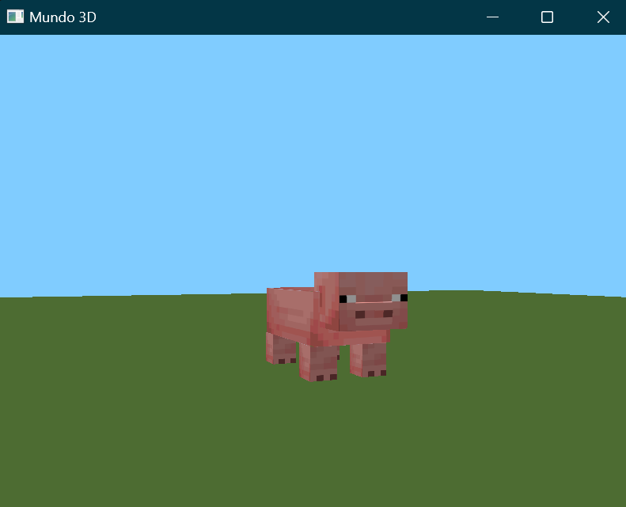

## Modelo 3 (Vaca)
~~~
def draw_cow():
    
    # Definimos las texturas de cada cara del cubo de la cabeza 
    texturas_cow_head = {
        "frontal": "cow", 
        "trasera": "cow_body", 
        "izquierda": "cow_ear1", 
        "derecha": "cow_ear2", 
        "arriba": "cow_body", 
        "abajo": "cow_body"
    }
    # Dibujamos la cabeza de la vaca
    draw_cubo(3, 2.2, 0, 1, 1, 0.8, texturas_cow_head)
    
    # Definimos las texturas de cada cara del cubo del cuerpo
    texturas_cow_body = {
        "frontal": "cow_body", 
        "trasera": "cow_tail", 
        "izquierda": "cow_body", 
        "derecha": "cow_body", 
        "arriba": "cow_body", 
        "abajo": "cow_body"
    }
    # Dibujamos el cuerpo de la vaca
    draw_cubo(2.9, 1.5, -1.8, 1.2, 1.5, 2, texturas_cow_body)
    
    # Definimos las texturas de cada cara del cubo de las piernas
    texturas_cow_leg = {
        "frontal": "cow_leg1", 
        "trasera": "cow_leg2", 
        "izquierda": "cow_leg1", 
        "derecha": "cow_leg1", 
        "arriba": "cow_body", 
        "abajo": "cow_body"
    }
    # Dibujamos la pierna izquerda trasera 
    draw_cubo(2.9, 0, -1.75, 0.4, 1.5, 0.4, texturas_cow_leg)
    # Dibujamos la pierna derecha trasera 
    draw_cubo(3.7, 0, -1.75, 0.4, 1.5, 0.4, texturas_cow_leg)
    # Dibujamos la pierna izquerda frontal 
    draw_cubo(2.9, 0, -0.2, 0.4, 1.5, 0.4, texturas_cow_leg)
    # Dibujamos la pierna derecha frontal 
    draw_cubo(3.7, 0, -0.2, 0.4, 1.5, 0.4, texturas_cow_leg)
~~~
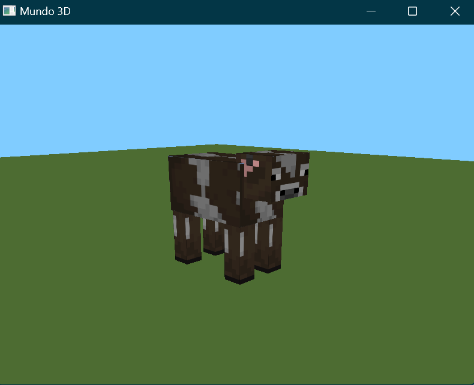
## Modelo 4 (Oveja)
~~~
def draw_sheep():
    
    # Definimos las texturas de cada cara del cubo de la cabeza 
    texturas_sheep_head = {
        "frontal": "sheep", 
        "trasera": "sheep_body", 
        "izquierda": "sheep_body", 
        "derecha": "sheep_body", 
        "arriba": "sheep_body", 
        "abajo": "sheep_body"
    }
    # Dibujamos la cabeza de la oveja
    draw_cubo(3.1, 1.8, 0, 0.8, 1, 0.8, texturas_sheep_head)
    
    # Definimos las texturas de cada cara del cubo del cuerpo
    texturas_sheep_body = {
        "frontal": "sheep_body", 
        "trasera": "sheep_body", 
        "izquierda": "sheep_body", 
        "derecha": "sheep_body", 
        "arriba": "sheep_body", 
        "abajo": "sheep_body"
    }
    # Dibujamos el cuerpo de la oveja
    draw_cubo(2.8, 1, -1.8, 1.4, 1.2, 2.1, texturas_sheep_body)
    
    # Definimos las texturas de cada cara del cubo de las piernas en la parte superior
    texturas_sheep_leg_upper = {
        "frontal": "sheep_leg_upper", 
        "trasera": "sheep_leg_upper", 
        "izquierda": "sheep_leg_upper", 
        "derecha": "sheep_leg_upper", 
        "arriba": "sheep_leg_upper", 
        "abajo": "sheep_leg_upper"
    }
    # Dibujamos la pierna izquerda trasera superior
    draw_cubo(2.85, 0.5, -1.75, 0.55, 0.5, 0.4, texturas_sheep_leg_upper)
    # Dibujamos la pierna derecha trasera superior
    draw_cubo(3.65, 0.5, -1.75, 0.55, 0.5, 0.4, texturas_sheep_leg_upper)
    # Dibujamos la pierna izquerda frontal superior
    draw_cubo(2.85, 0.5, -0.2, 0.55, 0.5, 0.4, texturas_sheep_leg_upper)
    # Dibujamos la pierna derecha frontal superior
    draw_cubo(3.65, 0.5, -0.2, 0.55, 0.5, 0.4, texturas_sheep_leg_upper)
    
    # Definimos las texturas de cada cara del cubo de las piernas en la parte inferior
    texturas_sheep_leg_lower = {
        "frontal": "sheep_leg", 
        "trasera": "sheep_leg", 
        "izquierda": "sheep_leg", 
        "derecha": "sheep_leg", 
        "arriba": "sheep_leg", 
        "abajo": "sheep_leg"
    }
    # Dibujamos la pierna izquerda trasera inferior
    draw_cubo(2.9, 0, -1.745, 0.4, 0.5, 0.3, texturas_sheep_leg_lower)
    # Dibujamos la pierna derecha trasera inferior
    draw_cubo(3.7, 0, -1.745, 0.4, 0.5, 0.3, texturas_sheep_leg_lower)
    # Dibujamos la pierna izquerda frontal inferior
    draw_cubo(2.9, 0, -0.15, 0.4, 0.5, 0.3, texturas_sheep_leg_lower)
    # Dibujamos la pierna derecha frontal inferior
    draw_cubo(3.7, 0, -0.15, 0.4, 0.5, 0.3, texturas_sheep_leg_lower)
~~~
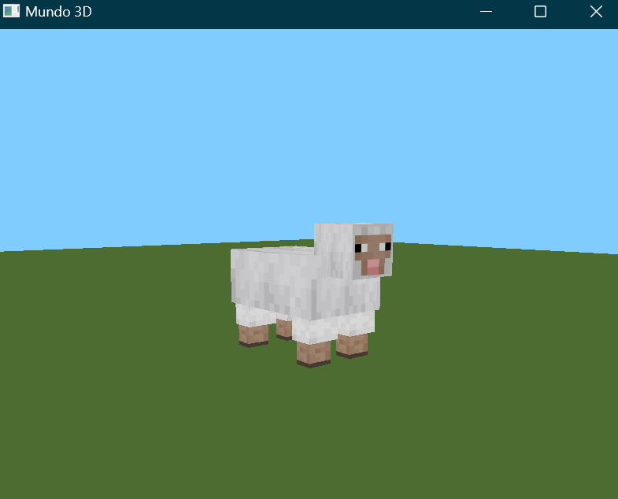
## Modelo 5 (Lobo, probablemente el mas tardado)
~~~
def draw_wolf():
    
    # Definimos las texturas de cada cara del cubo de la cabeza 
    texturas_wolf_head = {
        "frontal": "wolf", 
        "trasera": "wolf_body", 
        "izquierda": "wolf_1", 
        "derecha": "wolf_2", 
        "arriba": "wolf_body", 
        "abajo": "wolf_body"
    }
    # Dibujamos la cabeza del lobo
    draw_cubo(0.1, 1.1, 0, 0.8, 1, 0.4, texturas_wolf_head)
    
    # Definimos las texturas de cada cara del cubo de las orejas
    texturas_wolf_ears = {
        "frontal": "wolf_body", 
        "trasera": "wolf_body", 
        "izquierda": "wolf_ears", 
        "derecha": "wolf_ears", 
        "arriba": "wolf_ears", 
        "abajo": "wolf_body"
    }
    # Dibujamos las orejas del lobo
    draw_cubo(0.1, 2.1, 0.05, 0.25, 0.35, 0.1, texturas_wolf_ears)
    draw_cubo(0.65, 2.1, 0.05, 0.25, 0.35, 0.1, texturas_wolf_ears)
    
    # Definimos las texturas de cada cara del cubo de la nariz
    texturas_wolf_nose = {
        "frontal": "wolf_nose_front", 
        "trasera": "wolf_body", 
        "izquierda": "wolf_nose_left", 
        "derecha": "wolf_nose_right", 
        "arriba": "wolf_nose_upper", 
        "abajo": "wolf_body"
    }
    # Dibujamos la cabeza del lobo
    draw_cubo(0.3, 1.1, 0.4, 0.4, 0.6, 0.4, texturas_wolf_nose)
    
    # Definimos las texturas de cada cara del cubo del cuello
    texturas_wolf_neck = {
        "frontal": "wolf_body", 
        "trasera": "wolf_body", 
        "izquierda": "wolf_neck1", 
        "derecha": "wolf_neck2", 
        "arriba": "wolf_body", 
        "abajo": "wolf_body"
    }
    # Dibujamos el cuello del lobo
    draw_cubo(0, 0.98, -0.75, 1, 1.2, 0.8, texturas_wolf_neck)
    
    # Definimos las texturas de cada cara del cubo del cuerpo
    texturas_wolf_body = {
        "frontal": "wolf_body", 
        "trasera": "wolf_body", 
        "izquierda": "wolf_body", 
        "derecha": "wolf_body", 
        "arriba": "wolf_body", 
        "abajo": "wolf_body"
    }
    # Dibujamos el cuerpo del lobo
    draw_cubo(0.1, 1, -2, 0.8, 1, 1.6, texturas_wolf_body)
    
    # Definimos las texturas de cada cara del cubo de las piernas
    texturas_wolf_leg = {
        "frontal": "wolf_leg", 
        "trasera": "wolf_leg", 
        "izquierda": "wolf_leg", 
        "derecha": "wolf_leg", 
        "arriba": "wolf_leg", 
        "abajo": "wolf_leg"
    }
    # Dibujamos la pierna izquerda trasera 
    draw_cubo(0.1, 0, -1.85, 0.25, 1, 0.2, texturas_wolf_leg)
    # Dibujamos la pierna derecha trasera 
    draw_cubo(0.65, 0, -1.85, 0.25, 1, 0.2, texturas_wolf_leg)
    # Dibujamos la pierna izquerda frontal 
    draw_cubo(0.1, 0, -0.4, 0.25, 1, 0.2, texturas_wolf_leg)
    # Dibujamos la pierna derecha frontal 
    draw_cubo(0.65, 0, -0.4, 0.25, 1, 0.2, texturas_wolf_leg)
    
    # Dibujamos la cola
    draw_cubo(0.35, 1.65, -2.6, 0.3, 0.3, 0.6, texturas_wolf_body)
~~~

## Modelo 6 (Valla de madera en t vista por enfrente)
~~~
def draw_fence_front():
    # Definimos las texturas de cada cara del cubo de la valla en forma de t
    texturas_fence_t = {
        "frontal": "fence", 
        "trasera": "fence", 
        "izquierda": "fence", 
        "derecha": "fence", 
        "arriba": "fence_up", 
        "abajo": "fence_up"
    }
    # Dibujamos la valla central
    draw_cubo(0, 0, -0.4, 0.4, 2, 0.4, texturas_fence_t)
    
    texturas_fence_t_upper = {
        "frontal": "fence_1", 
        "trasera": "fence_1", 
        "izquierda": "fence_upper", 
        "derecha": "fence_upper", 
        "arriba": "fence_upper", 
        "abajo": "fence_upper"
    }
    # Dibujamos las vallas que salen de la central por arriba
    draw_cubo(0.4, 1.4, -0.35, 0.6, 0.4, 0.3, texturas_fence_t_upper)
    draw_cubo(-0.6, 1.4, -0.35, 0.6, 0.4, 0.3, texturas_fence_t_upper)
    
    texturas_fence_t_lower = {
        "frontal": "fence_2", 
        "trasera": "fence_2", 
        "izquierda": "fence_upper", 
        "derecha": "fence_upper", 
        "arriba": "fence_upper", 
        "abajo": "fence_upper"
    }
    # Dibujamos las vallas que salen de la central por abajo
    draw_cubo(0.4, 0.6, -0.35, 0.6, 0.4, 0.3, texturas_fence_t_lower)
    draw_cubo(-0.6, 0.6, -0.35, 0.6, 0.4, 0.3, texturas_fence_t_lower)
~~~
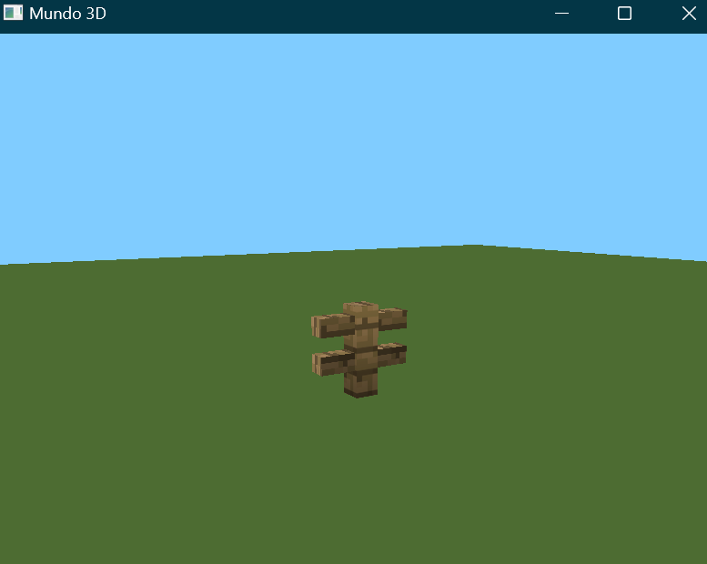
## Modelo 7 (Valla de madera en t vista por el lateral)
~~~
def draw_fence_side():
    
    # Definimos las texturas de cada cara del cubo de la valla en forma de t vista desde el lateral
    texturas_fence_t = {
        "frontal": "fence", 
        "trasera": "fence", 
        "izquierda": "fence", 
        "derecha": "fence", 
        "arriba": "fence_up", 
        "abajo": "fence_up"
    }
    # Dibujamos la valla central
    draw_cubo(0, 0, -0.4, 0.4, 2, 0.4, texturas_fence_t)
    
    texturas_fence_t_upper = {
        "frontal": "fence_1", 
        "trasera": "fence_1", 
        "izquierda": "fence_1", 
        "derecha": "fence_1", 
        "arriba": "fence_upper", 
        "abajo": "fence_upper"
    }
    # Dibujamos las vallas que salen de la central por arriba
    draw_cubo(0.05, 1.4, -1, 0.3, 0.4, 0.6, texturas_fence_t_upper)
    draw_cubo(0.05, 1.4, 0, 0.3, 0.4, 0.6, texturas_fence_t_upper)
    
    texturas_fence_t_lower = {
        "frontal": "fence_2", 
        "trasera": "fence_2", 
        "izquierda": "fence_2", 
        "derecha": "fence_2", 
        "arriba": "fence_upper", 
        "abajo": "fence_upper"
    }
    # Dibujamos las vallas que salen de la central por abajo
    draw_cubo(0.05, 0.6, -1, 0.3, 0.4, 0.6, texturas_fence_t_lower)
    draw_cubo(0.05, 0.6, 0, 0.3, 0.4, 0.6, texturas_fence_t_lower)
~~~    
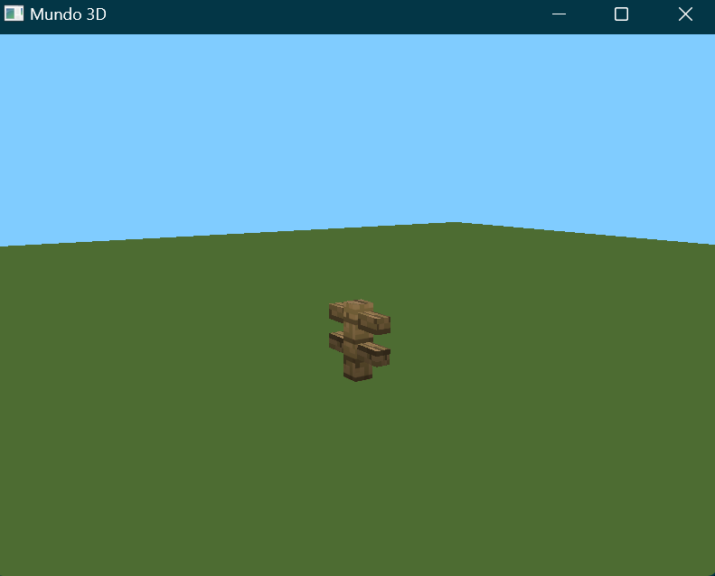
## Modelo 8 (Valla de madera esquina 1)
~~~
def draw_fence_corner_1():
    
    # Definimos las texturas de cada cara del cubo de la valla de la esquina 1
    texturas_fence_t = {
        "frontal": "fence", 
        "trasera": "fence", 
        "izquierda": "fence", 
        "derecha": "fence", 
        "arriba": "fence_up", 
        "abajo": "fence_up"
    }
    # Dibujamos la valla central
    draw_cubo(0, 0, -0.4, 0.4, 2, 0.4, texturas_fence_t)
    
    texturas_fence_t_upper = {
        "frontal": "fence_1", 
        "trasera": "fence_1", 
        "izquierda": "fence_1", 
        "derecha": "fence_1", 
        "arriba": "fence_upper", 
        "abajo": "fence_upper"
    }
    # Dibujamos las vallas que salen de la central por arriba
    draw_cubo(0.4, 1.4, -0.35, 0.6, 0.4, 0.3, texturas_fence_t_upper)
    draw_cubo(0.05, 1.4, 0, 0.3, 0.4, 0.6, texturas_fence_t_upper)
    
    texturas_fence_t_lower = {
        "frontal": "fence_2", 
        "trasera": "fence_2", 
        "izquierda": "fence_2", 
        "derecha": "fence_2", 
        "arriba": "fence_upper", 
        "abajo": "fence_upper"
    }
    # Dibujamos las vallas que salen de la central por abajo
    draw_cubo(0.4, 0.6, -0.35, 0.6, 0.4, 0.3, texturas_fence_t_lower)
    draw_cubo(0.05, 0.6, 0, 0.3, 0.4, 0.6, texturas_fence_t_upper)
~~~

## Modelo 9 (Valla de madera esquina 2)   
~~~
def draw_fence_corner_2():
    
    # Definimos las texturas de cada cara del cubo de la valla de la esquina 2
    texturas_fence_t = {
        "frontal": "fence", 
        "trasera": "fence", 
        "izquierda": "fence", 
        "derecha": "fence", 
        "arriba": "fence_up", 
        "abajo": "fence_up"
    }
    # Dibujamos la valla central
    draw_cubo(0, 0, -0.4, 0.4, 2, 0.4, texturas_fence_t)
    
    texturas_fence_t_upper = {
        "frontal": "fence_1", 
        "trasera": "fence_1", 
        "izquierda": "fence_1", 
        "derecha": "fence_1", 
        "arriba": "fence_upper", 
        "abajo": "fence_upper"
    }
    # Dibujamos las vallas que salen de la central por arriba
    draw_cubo(-0.6, 1.4, -0.35, 0.6, 0.4, 0.3, texturas_fence_t_upper) # Izquierda
    draw_cubo(0.05, 1.4, 0, 0.3, 0.4, 0.6, texturas_fence_t_upper) # Centro-abajo
    
    texturas_fence_t_lower = {
        "frontal": "fence_2", 
        "trasera": "fence_2", 
        "izquierda": "fence_2", 
        "derecha": "fence_2", 
        "arriba": "fence_upper", 
        "abajo": "fence_upper"
    }
    # Dibujamos las vallas que salen de la central por abajo
    draw_cubo(-0.6, 0.6, -0.35, 0.6, 0.4, 0.3, texturas_fence_t_lower) # Izquierda
    draw_cubo(0.05, 0.6, 0, 0.3, 0.4, 0.6, texturas_fence_t_upper) # Centro-abajo
~~~
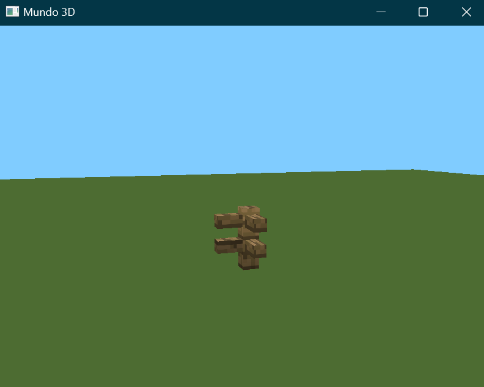

## Modelo 10 (Valla de madera esquina 3)  
~~~
def draw_fence_corner_3():
    
    # Definimos las texturas de cada cara del cubo de la valla de la esquina 3
    texturas_fence_t = {
        "frontal": "fence", 
        "trasera": "fence", 
        "izquierda": "fence", 
        "derecha": "fence", 
        "arriba": "fence_up", 
        "abajo": "fence_up"
    }
    # Dibujamos la valla central
    draw_cubo(0, 0, -0.4, 0.4, 2, 0.4, texturas_fence_t)
    
    texturas_fence_t_upper = {
        "frontal": "fence_1", 
        "trasera": "fence_1", 
        "izquierda": "fence_1", 
        "derecha": "fence_1", 
        "arriba": "fence_upper", 
        "abajo": "fence_upper"
    }
    # Dibujamos las vallas que salen de la central por arriba
    draw_cubo(-0.6, 1.4, -0.35, 0.6, 0.4, 0.3, texturas_fence_t_upper) # Izquierda
    draw_cubo(0.05, 1.4, -1, 0.3, 0.4, 0.6, texturas_fence_t_upper) # Centro-arriba
    
    texturas_fence_t_lower = {
        "frontal": "fence_2", 
        "trasera": "fence_2", 
        "izquierda": "fence_2", 
        "derecha": "fence_2", 
        "arriba": "fence_upper", 
        "abajo": "fence_upper"
    }
    # Dibujamos las vallas que salen de la central por abajo
    draw_cubo(-0.6, 0.6, -0.35, 0.6, 0.4, 0.3, texturas_fence_t_lower) # Izquierda
    draw_cubo(0.05, 0.6, -1, 0.3, 0.4, 0.6, texturas_fence_t_upper) # Centro-arriba
~~~
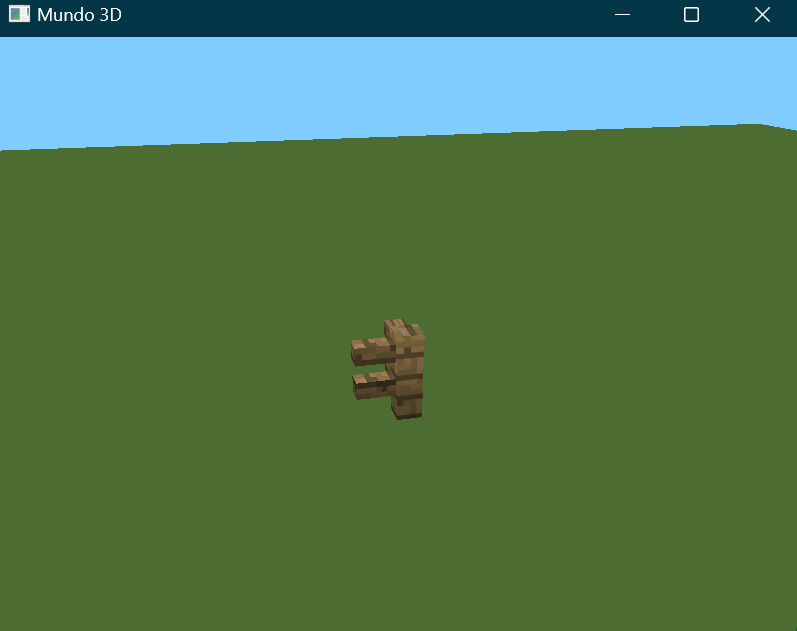

## Modelo 11 (Valla de madera esquina 4)   
~~~
def draw_fence_corner_4():
    
    # Definimos las texturas de cada cara del cubo de la valla de la esquina 4
    texturas_fence_t = {
        "frontal": "fence", 
        "trasera": "fence", 
        "izquierda": "fence", 
        "derecha": "fence", 
        "arriba": "fence_up", 
        "abajo": "fence_up"
    }
    # Dibujamos la valla central
    draw_cubo(0, 0, -0.4, 0.4, 2, 0.4, texturas_fence_t)
    
    texturas_fence_t_upper = {
        "frontal": "fence_1", 
        "trasera": "fence_1", 
        "izquierda": "fence_1", 
        "derecha": "fence_1", 
        "arriba": "fence_upper", 
        "abajo": "fence_upper"
    }
    # Dibujamos las vallas que salen de la central por arriba
    draw_cubo(0.4, 1.4, -0.35, 0.6, 0.4, 0.3, texturas_fence_t_upper) # Izquierda
    draw_cubo(0.05, 1.4, -1, 0.3, 0.4, 0.6, texturas_fence_t_upper) # Centro-arriba
    
    texturas_fence_t_lower = {
        "frontal": "fence_2", 
        "trasera": "fence_2", 
        "izquierda": "fence_2", 
        "derecha": "fence_2", 
        "arriba": "fence_upper", 
        "abajo": "fence_upper"
    }
    # Dibujamos las vallas que salen de la central por abajo
    draw_cubo(0.4, 0.6, -0.35, 0.6, 0.4, 0.3, texturas_fence_t_lower) # Izquierda
    draw_cubo(0.05, 0.6, -1, 0.3, 0.4, 0.6, texturas_fence_t_lower) # Centro-arriba
~~~
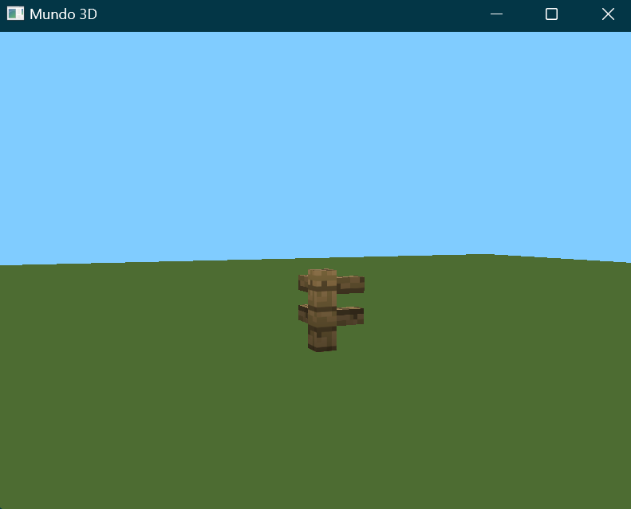

## Modelo 12 (Corral de vallas de madera 5x5):
~~~
def draw_corral(n):
    
    # Dibujamos la esquina 1 del corral
    draw_fence_corner_1()
    # Con un ciclo for dibujamos las vallas frontales de la parte superior del corral
    for i in range(n):
        glTranslatef(1.6, 0, 0)
        draw_fence_front()
    # Dibujamos la esquina 2 del corral
    glTranslatef(1.6, 0, 0)    
    draw_fence_corner_2()
    # Repetimos el ciclo for para las vallas laterales de la derecha
    for i in range(n):
        glTranslatef(0, 0, 1.6)
        draw_fence_side()
    # Dibujamos la esquina 3 del corral
    glTranslatef(0, 0, 1.6)    
    draw_fence_corner_3()
    # Con un ciclo for dibujamos las vallas frontales de la parte inferior del corral
    for i in range(n):
        glTranslatef(-1.6, 0, 0)
        draw_fence_front()
    # Dibujamos la esquina 4 del corral
    glTranslatef(-1.6, 0, 0)    
    draw_fence_corner_4()
    # Repetimos el ciclo for para las vallas laterales de la izquierda
    for i in range(n):
        glTranslatef(0, 0, -1.6)
        draw_fence_side()
~~~
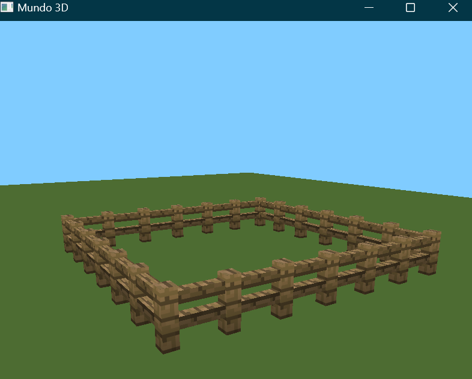

## Modelo 13 (Steve)
~~~
def draw_steve():
    
    # Definimos las texturas de cada cara del cubo de la cabeza 
    texturas_steve_head = {
        "frontal": "steve", 
        "trasera": "steve_hair2", 
        "izquierda": "steve_ear1", 
        "derecha": "steve_ear2", 
        "arriba": "steve_hair1", 
        "abajo": "steve_lower"
    }
    # Dibujamos la cabeza del steve
    draw_cubo(0, 3, -0.125, 1, 1, 0.75, texturas_steve_head) 
    
    # Definimos las texturas de cada cara del cubo de las piernas
    texturas_steve_legs = {
        "frontal": "steve_legs1", 
        "trasera": "steve_legs2", 
        "izquierda": "steve_legs3", 
        "derecha": "steve_legs4", 
        "arriba": "steve_hair1", 
        "abajo": "steve_hair1"
    }
    # Dibujamos las piernas del steve
    draw_cubo(0, 0, 0, 1, 1.5, 0.5, texturas_steve_legs) 
    
    # Definimos las texturas de cada cara del cubo de el cuerpo
    texturas_steve_body = {
        "frontal": "steve_body", 
        "trasera": "steve_back", 
        "izquierda": "steve_back", 
        "derecha": "steve_back", 
        "arriba": "steve_body_upper", 
        "abajo": "steve_hair1"
    }
    # Dibujamos el cuerpo del steve
    draw_cubo(-0.02, 1.5, 0, 1.04, 1.5, 0.5, texturas_steve_body) 
    
    # Definimos las texturas de cada cara del cubo de el brazo izquierdo
    texturas_steve_left_arm = {
        "frontal": "steve_arm1", 
        "trasera": "steve_arm2", 
        "izquierda": "steve_arm3", 
        "derecha": "steve_arm3", 
        "arriba": "steve_arm5", 
        "abajo": "fence_up"
    }
    # Dibujamos el brazo izquierdo de steve
    draw_cubo(-0.452, 1.5, 0, 0.45, 1.5, 0.5, texturas_steve_left_arm) 
    
    # Definimos las texturas de cada cara del cubo de el brazo derecho
    texturas_steve_right_arm = {
        "frontal": "steve_arm1", 
        "trasera": "steve_arm2", 
        "izquierda": "steve_arm4", 
        "derecha": "steve_arm4", 
        "arriba": "steve_arm5", 
        "abajo": "fence_up"
    }
    # Dibujamos el brazo derecho de steve
    draw_cubo(1.02, 1.5, 0, 0.45, 1.5, 0.5, texturas_steve_right_arm) 
~~~
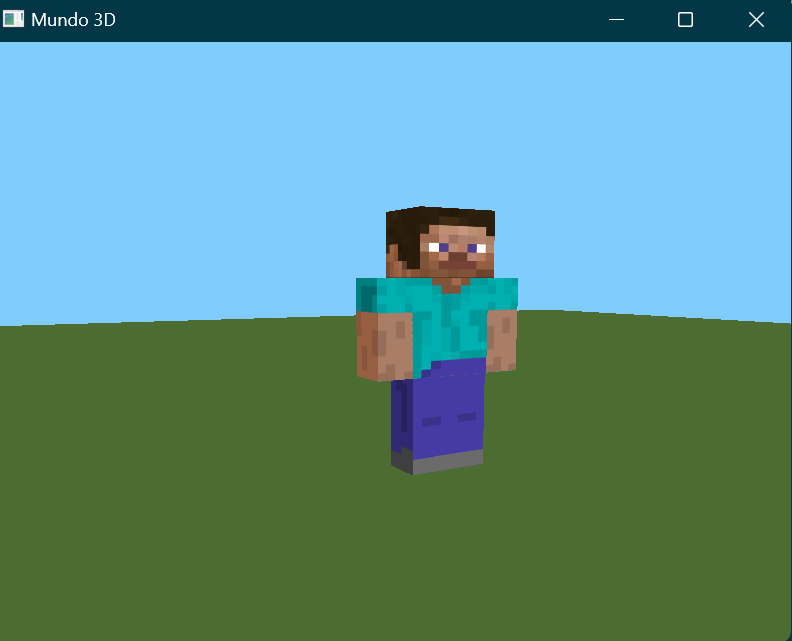

## Modelo 14 (Creeper)
~~~
def draw_creeper():
    
    # Definimos las texturas de cada cara del cubo de la cabeza 
    texturas_creeper_head = {
        "frontal": "creeper", 
        "trasera": "creeper_upper", 
        "izquierda": "creeper_upper", 
        "derecha": "creeper_upper", 
        "arriba": "creeper_upper", 
        "abajo": "creeper_upper"
    }
    # Dibujamos la cabeza del creeper
    draw_cubo(0, 2.6, -0.125, 1, 1, 0.75, texturas_creeper_head) 
    
    # Definimos las texturas de cada cara del cubo de las piernas frontales
    texturas_crepper_legs1 = {
        "frontal": "creeper_legs", 
        "trasera": "creeper_legs3", 
        "izquierda": "creeper_legs1", 
        "derecha": "creeper_legs2", 
        "arriba": "creeper_upper", 
        "abajo": "creeper_upper"
    }
    # Dibujamos las piernas frontales del creeper
    draw_cubo(0, 0, 0.5, 1, 0.6, 0.4, texturas_crepper_legs1) 
    
    # Definimos las texturas de cada cara del cubo de las piernas traseras
    texturas_crepper_legs2 = {
        "frontal": "creeper_legs", 
        "trasera": "creeper_legs3", 
        "izquierda": "creeper_legs1", 
        "derecha": "creeper_legs2", 
        "arriba": "creeper_upper", 
        "abajo": "creeper_upper"
    }
    # Dibujamos las piernas traseras del creeper
    draw_cubo(0, 0, -0.4, 1, 0.6, 0.4, texturas_crepper_legs2) 
    
    # Definimos las texturas de cada cara del cubo de el cuerpo
    texturas_creeper_body = {
        "frontal": "creeper_body", 
        "trasera": "creeper_back", 
        "izquierda": "creeper_back", 
        "derecha": "creeper_back", 
        "arriba": "creeper_back", 
        "abajo": "creeper_back"
    }
    # Dibujamos el cuerpo del creeper
    draw_cubo(0, 0.6, 0, 1, 2, 0.5, texturas_creeper_body) 
~~~

## Modelo 15 (Slime)
~~~
def draw_slime():
    
    # Definimos las texturas de cada cara del cubo de la cabeza 
    texturas_slime = {
        "frontal": "slime", 
        "trasera": "slime_back", 
        "izquierda": "slime1", 
        "derecha": "slime1", 
        "arriba": "slime_upper", 
        "abajo": "slime_upper"
    }
    # Dibujamos el slime
    draw_cubo(0, 0, 0, 2, 2, 2, texturas_slime) 
~~~

## Modelo 16 (Herobrine)
~~~
def draw_herobrine():
    
    # Definimos las texturas de cada cara del cubo de la cabeza 
    texturas_herobrine_head = {
        "frontal": "herobrine", 
        "trasera": "steve_hair2", 
        "izquierda": "steve_ear1", 
        "derecha": "steve_ear2", 
        "arriba": "steve_hair1", 
        "abajo": "steve_lower"
    }
    # Dibujamos la cabeza del herobrine
    draw_cubo(0, 3, -0.125, 1, 1, 0.75, texturas_herobrine_head) 
    
    # Definimos las texturas de cada cara del cubo de las piernas
    texturas_steve_legs = {
        "frontal": "steve_legs1", 
        "trasera": "steve_legs2", 
        "izquierda": "steve_legs3", 
        "derecha": "steve_legs4", 
        "arriba": "steve_hair1", 
        "abajo": "steve_hair1"
    }
    # Dibujamos las piernas del steve
    draw_cubo(0, 0, 0, 1, 1.5, 0.5, texturas_steve_legs) 
    
    # Definimos las texturas de cada cara del cubo de el cuerpo
    texturas_steve_body = {
        "frontal": "steve_body", 
        "trasera": "steve_back", 
        "izquierda": "steve_back", 
        "derecha": "steve_back", 
        "arriba": "steve_body_upper", 
        "abajo": "steve_hair1"
    }
    # Dibujamos el cuerpo del steve
    draw_cubo(-0.02, 1.5, 0, 1.04, 1.5, 0.5, texturas_steve_body) 
    
    # Definimos las texturas de cada cara del cubo de el brazo izquierdo
    texturas_steve_left_arm = {
        "frontal": "steve_arm1", 
        "trasera": "steve_arm2", 
        "izquierda": "steve_arm3", 
        "derecha": "steve_arm3", 
        "arriba": "steve_arm5", 
        "abajo": "fence_up"
    }
    # Dibujamos el brazo izquierdo de steve
    draw_cubo(-0.452, 1.5, 0, 0.45, 1.5, 0.5, texturas_steve_left_arm) 
    
    # Definimos las texturas de cada cara del cubo de el brazo derecho
    texturas_steve_right_arm = {
        "frontal": "steve_arm1", 
        "trasera": "steve_arm2", 
        "izquierda": "steve_arm4", 
        "derecha": "steve_arm4", 
        "arriba": "steve_arm5", 
        "abajo": "fence_up"
    }
    # Dibujamos el brazo derecho de steve
    draw_cubo(1.02, 1.5, 0, 0.45, 1.5, 0.5, texturas_steve_right_arm)  
~~~
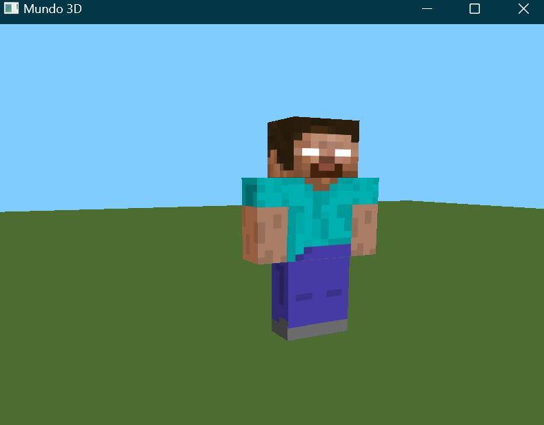

## Posiciones inicial de las vacas
##### Se define un diccionario que servirá para poder hacer una pequeña animación de movimiento de las vacas, en este arreglo se guarda la posición de la vaca y su velocidad de movimiento en X y en Z
~~~
cows_data = [
    {"pos": [25, 0, 0], "dir": [0.1, 0.1]},  
    {"pos": [21, 0, 0], "dir": [0.1, 0.1]}
    ]
~~~

## Función para mover a las vacas en el corral
##### Similar a lo visto en clase, en esta función se define un área de la cual no pueden salir y mediante un ciclo se actualiza el movimiento de las vacas, en caso de que lleguen a uno de los limites se invierte la dirección en ese eje, simulando un "rebote" dentro del corral
~~~
def actualizar_posiciones():
    """Actualiza las posiciones de las vacas, manteniéndolas dentro del área delimitada."""
    
    # Area del corral 
    area_limites = {
    "xmin": 17.5,
    "xmax": 25.5,
    "zmin": -3,
    "zmax": 4
    }
    
    for cow in cows_data:
        x, y, z = cow["pos"]
        dx, dz = cow["dir"]
        
        # Actualizar posición
        x += dx
        z += dz
        
        # Verificar colisiones con los bordes del área y rebotar
        if x < area_limites["xmin"] or x > area_limites["xmax"]:
            dx = -dx  # Cambiar dirección en X
        if z < area_limites["zmin"] or z > area_limites["zmax"]:
            dz = -dz  # Cambiar dirección en Z
        
        # Guardar nueva posición y dirección
        cow["pos"] = [x, y, z]
        cow["dir"] = [dx, dz]
~~~

## Función para dibujar el entorno con todos los modelos previamente definidos
##### En esta función se definen arreglos para cada modelo con los puntos en los cuales se van a dibujar dicho modelo, además de inicializar la cámara y dibujar el suelo
~~~
def draw_entorno():
    """Función para generar el entorno del mundo"""
    glClear(GL_COLOR_BUFFER_BIT | GL_DEPTH_BUFFER_BIT)
    glLoadIdentity()
    gluLookAt(pos_x, pos_y, pos_z,  # Posición de la cámara
              look_x, 2, 0,  # Punto al que mira
              0, 1, 0)  # Vector hacia arriba
    draw_ground('grass')
    
    # Posiciones para dibujar los arboles en el mundo
    arboles_positions = [
        (-5, 0, -5),  
        (5, 0, -5),  
        (-5, 0, 5),   
        (5, 0, 5),
        (0, 0, 0),
        (10, 0, 0),
        (-10, 0, 2),
        (11, 0, 8),
        (7, 0, -12),
        (-1, 0, 10),
        
        # Arboles en cada esquina del plano
        (-28, 0, -29),  
        (-28, 0, 29),  
        (28, 0, -29),   
        (28, 0, 29)
    ]
    
    # Posiciones para dibujar los cerditos en el mundo
    pigs_positions = [
        (-2, 0, -5),  
        (5, 0, -8),   
        (-7, 0, 6),   
        (2, 0, 9),
        (3, 0, 0),
        (-5, 0, 12),
        (6, 0, 20)
    ]
    
    # Posiciones para dibujar las vacas en el mundo
    cows_positions = [
        (-28, 0, -26),  
        #(25, 0, 0),   
        (-16, 0, 4),   
        #(21, 0, 0),
        (12, 0, 19),
        (4, 0, 4),
        (-6, 0, -1)
    ]
    
    # Posiciones para dibujar las ovejas en el mundo
    sheep_positions = [
        (-29, 0, -1),  
        (-20, 0, 5),   
        (-24, 0, -4),   
        (-26, 0, 7),
        (-18, 0, 5),
        (-8, 0, 3)
    ]
    
    # Posiciones para dibujar los lobos en el mundo
    wolves_positions = [
        (29, 0, -8),  
        (20, 0, 8),   
        (24, 0, 9),   
        (26, 0, 12),
        (18, 0, 5),
        (5, 9.5, -3)
    ]
    
    # Posiciones para dibujar los corrales en el mundo
    corral_positions = [
        (20, 0, -5),
        (-10, 0, -25),
        (-20, 0, 16)
    ]
        
    # Posiciones para dibujar a steve en el mundo
    steve_positions = [
        (15, 0, -5)
    ]  
    
    # Posiciones para dibujar a los creepers en el mundo
    creepers_positions = [
        (-28, 0, -25),
        (0, 9.5, 0),
        (-28, 9.5, -29),
        (-2.5, 0, 0),
        (-18, 0, 18),
        (-16, 0, 23),
        (-13, 0, 20)
    ] 
    
    # Posiciones para dibujar a los slimes en el mundo
    slimes_positions = [
        (25, 0, 25),
        (28, 0, 26),
        (23, 0, 21),
        (24, 0, 28),
        (27, 9.5, 29),
        (-9, 0, -22),
        (-6, 0, -20),
        (-3, 0, -21)
    ] 
    
    # Posiciones para dibujar a herobrine en el mundo
    herobrine_positions = [
        (28, 0, -27)
    ]     
        
    # Ciclos para dibujar los modelos en sus posiciones respectos a los arreglos
    for pos in arboles_positions:
        glPushMatrix()
        glTranslatef(*pos)  
        draw_arbol()
        glPopMatrix()
        
    for pos in pigs_positions:
        glPushMatrix()
        glTranslatef(*pos)  
        draw_pig()
        glPopMatrix()
    
    for pos in cows_positions:
        glPushMatrix()
        glTranslatef(*pos)  
        draw_cow()
        glPopMatrix()
        
    for pos in sheep_positions:
        glPushMatrix()
        glTranslatef(*pos)  
        draw_sheep()
        glPopMatrix()
        
    for pos in wolves_positions:
        glPushMatrix()
        glTranslatef(*pos)  
        draw_wolf()
        glPopMatrix()
    
    for pos in corral_positions:
        glPushMatrix()
        glTranslatef(*pos)  
        draw_corral(5)
        glPopMatrix()
        
    for pos in steve_positions:
        glPushMatrix()
        glTranslatef(*pos)  
        draw_steve()        
        glPopMatrix()
        
    for pos in creepers_positions:
        glPushMatrix()
        glTranslatef(*pos)  
        draw_creeper()        
        glPopMatrix()
    
    for pos in slimes_positions:
        glPushMatrix()
        glTranslatef(*pos)  
        draw_slime()        
        glPopMatrix()
        
    for pos in herobrine_positions:
        glPushMatrix()
        glTranslatef(*pos)  
        draw_herobrine()        
        glPopMatrix()
    
    for cow in cows_data:
        glPushMatrix()
        glTranslatef(*cow["pos"])  
        draw_cow()
        glPopMatrix() 
       
    glfw.swap_buffers(window)
~~~
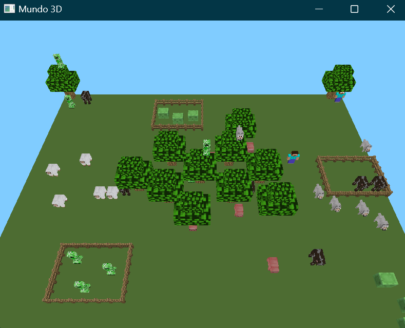
## Función para registrar las teclas y ejecutar sus acciones correspondientes
##### Se agrego esta función para comodidad del programador, ya que permite un movimiento mas sencillo que el que permite el flujo óptico
~~~
def key_callback(window, key, scancode, action, mods):
    """Procesa las entradas de teclado"""
    global pos_x, pos_y, pos_z, speed, look_x

    if action == glfw.PRESS or action == glfw.REPEAT:
        if key == glfw.KEY_LEFT:
            accion_flecha("flecha1")  # Mover hacia arriba
        elif key == glfw.KEY_RIGHT:
            accion_flecha("flecha2")  # Mover hacia abajo
        elif key == glfw.KEY_UP:
            accion_flecha("flecha3")  # Mover a la izquierda
        elif key == glfw.KEY_DOWN:
            accion_flecha("flecha4")  # Mover a la derecha
        elif key == glfw.KEY_SPACE:
            accion_flecha("flecha5")  # Mover hacia arriba
        elif key == glfw.KEY_LEFT_CONTROL:
            accion_flecha("flecha6")  # Mover hacia abajo
        elif key == glfw.KEY_R:
            pos_x = 0
            pos_y = 3
            pos_z = 10
        elif key == glfw.KEY_X:
            look_x = pos_x
        elif key == glfw.KEY_T:
            look_x = 0
        elif key == glfw.KEY_ESCAPE:
            glfw.set_window_should_close(window, True)
~~~
## Main donde se ejecuta todo
~~~
if not glfw.init():
    sys.exit()

# Crear ventana de GLFW
width, height = 800, 600
window = glfw.create_window(width, height, "Mundo 3D", None, None)
if not window:
    glfw.terminate()
    sys.exit()

glfw.make_context_current(window)
# Configurar callback de teclado
glfw.set_key_callback(window, key_callback)  
glViewport(0, 0, width, height)
init()

# Bucle principal
while not glfw.window_should_close(window):
    
    _, frame = cap.read()
    #frame tiene 640 de ancho y 480 de alto
    fgris = cv.cvtColor(frame, cv.COLOR_BGR2GRAY)
    p1, st, err = cv.calcOpticalFlowPyrLK(vgris, fgris, p0, None, **lkparm)
    # WaitKey para capturar alguna tecla
    key = cv.waitKey(1) & 0xFF
    
    #Mostramos la interfaz del programa
    mostrar_interfaz(frame)
    
    # Actulizacion de la posicion de las vacas en el corral
    actualizar_posiciones()
            
    # Si no hay cambio en el flujo optico se muestra la "malla" de puntos en sus posiciones iniciales
    if p1 is None:
        vgris = cv.cvtColor(vframe, cv.COLOR_BGR2GRAY)
        p0 = np.array([(100,100), (200,100), (300,100), (400,100) ])
        p0 = np.float32(p0[:, np.newaxis, :])
        mask = np.zeros_like(vframe)
        cv.imshow('Control', frame)
    # Si hay cambio en el flujo optico se inicia otro proceso
    else:
        bp1 = p1[st ==1]
        bp0 = p0[st ==1]
        
        # Se inicia un ciclo for que va a "buscar" el cambio en el flujo optico y va a dibujar un circulo en la nueva posicion
        # que registra el flujo optico y una linea que va a conectar el nuevo punto con el anterior
        for i, (nv, vj) in enumerate(zip(bp1, bp0)):
            a, b = (int(x) for x in nv.ravel())
            c, d = (int(x) for x in vj.ravel())
            dist = np.linalg.norm(nv.ravel() - vj.ravel())
            frame = cv.line(frame, (c,d), (a,b), (0,0,255), 2)
            frame = cv.circle(frame, (c,d), 2, (255,0,0),-1)
            frame = cv.circle(frame, (a,b), 3, (0,255,0),-1)
            
            # Ciclo para saber si se ejecutaran alguna accion en caso de haber tocado alguna flecha
            for flecha in ubicaciones_flechas:
                # Se busca dentro del diccionario si la bolita esta dentro de alguna de las areas de las flechas
                if punto_en_area(a, b, flecha["area"]):
                    # Si es asi ejecuta la funcion para la accion de la flecha correspondiente
                    accion_flecha(flecha["nombre"])
    
    draw_entorno()
    glfw.poll_events()
    cv.imshow('Control', frame)
    vgris = fgris.copy()

# Terminar y limpiar
glfw.terminate()
cv.destroyAllWindows()
~~~