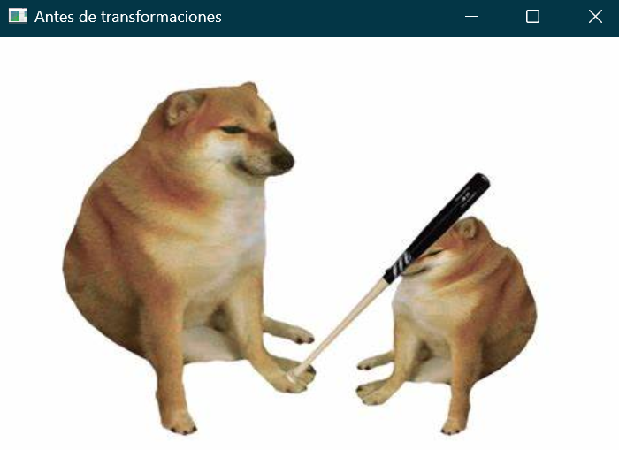
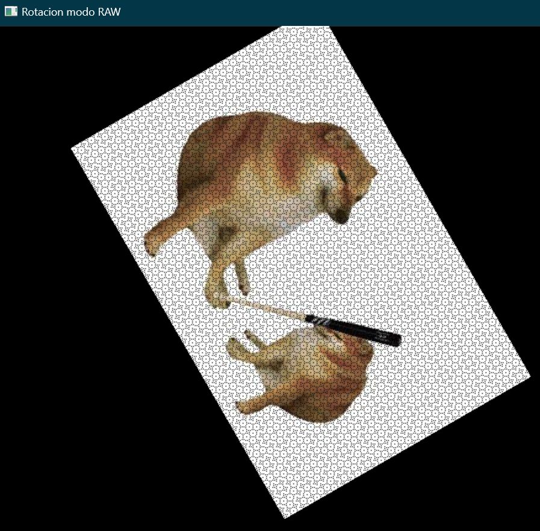
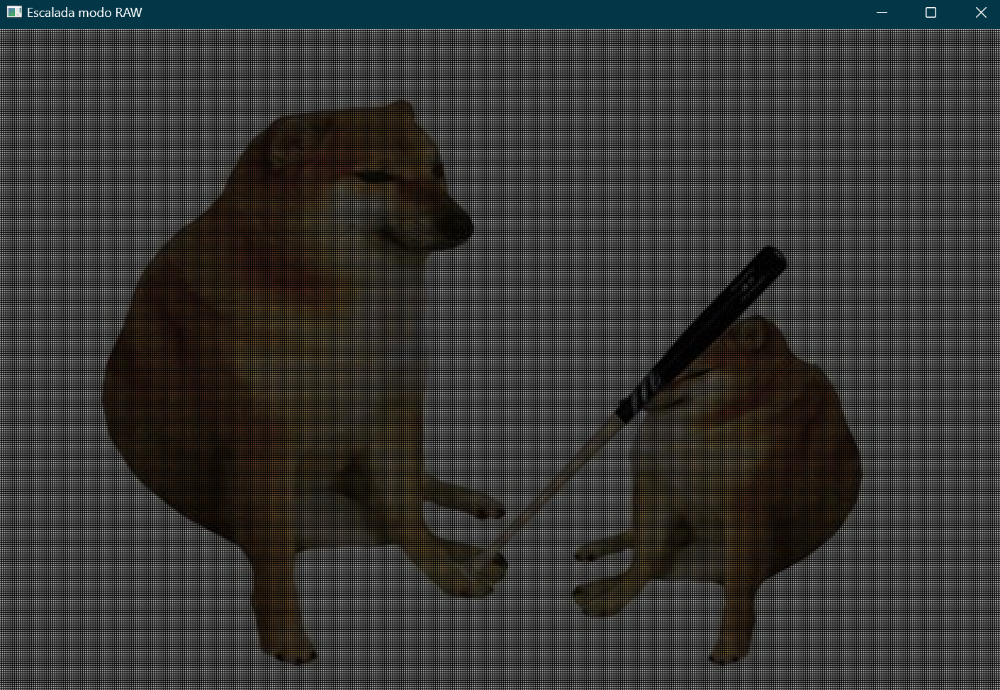
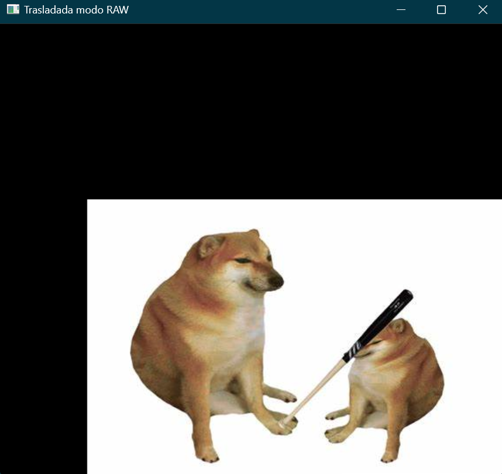

# Aplicación de las transformaciones geométricas vistas en  clase (modo RAW)
~~~
import cv2 as cv

import numpy as np

import math

  

#Se importa una imagen a color

img=cv.imread('bonk.jpeg', 1)

x,y,z=img.shape

#Se definen las variables necesarias para las transformaciones

traslacion_x=100

traslacion_y=200

escala_x=2

escala_y=2

angulo = 60

theta = math.radians(angulo)

#Se calcula el centro de la imagen para la rotacion

cx, cy = int(x  // 1.6), int(y  // 1.6)

#Se define el tamaño de las imagenes para de cada transformacion

trasladada_img=np.zeros((x+traslacion_y,y+traslacion_x,z), dtype=np.uint8)

escalada_img=np.zeros((int(x*escala_x),int(y*escala_y),z), dtype=np.uint8)

rotada_img = np.zeros((x*2, y*2, z), dtype=np.uint8)

  

#Ciclo para hacer la traslacion

for i in range(x+traslacion_y):

    for j in range(y+traslacion_x):

        new_x = i + traslacion_y

        new_y = j + traslacion_x

        if 0 <= new_x < x+traslacion_y and 0 <= new_y < y+traslacion_x:

            trasladada_img[new_x, new_y] = img[i, j]

  

#Ciclo para hacer el escalamiento

for i in range(int(x * escala_y)):

    for j in range(int(y * escala_x)):

        orig_x = int(i * escala_y)

        orig_y = int(j * escala_x)

        if 0 <= orig_x < x*escala_y and 0 <= orig_y < y*escala_x:

            escalada_img[orig_x, orig_y] = img[i, j]

#Ciclo para hacer la rotacion

for i in range(x):

    for j in range(y):

        new_x = int((j - cx) * math.cos(theta) - (i - cy) * math.sin(theta) + cx)

        new_y = int((j - cx) * math.sin(theta) + (i - cy) * math.cos(theta) + cy)

        if 0 <= new_x < y*2 and 0 <= new_y < x*2:

            rotada_img[new_y, new_x] = img[i, j]

  
  

#Se muestra el resultado de cada transformacion geometrica

cv.imshow("Trasladada modo RAW",trasladada_img)

cv.imshow("Escalada modo RAW",escalada_img)      

cv.imshow("Rotacion modo RAW",rotada_img)  

cv.imshow("Antes de transformaciones",img)

cv.waitKey(0)

cv.destroyAllWindows()
~~~

